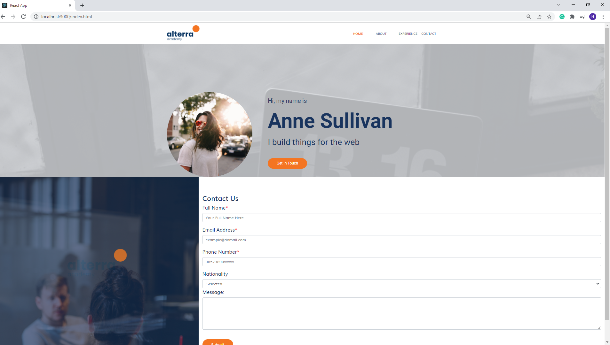

# Introduction React

## Resume Materi
Dalam materi ini, mempelajari:
- [Introduction React](#introduction-react)
  - [Resume Materi](#resume-materi)
    - [1. What is React? and Why React?](#1-what-is-react-and-why-react)
    - [2. Virtual DOM](#2-virtual-dom)
    - [3. Set up Development Environment](#3-set-up-development-environment)
  - [Task](#task)
    - [Membuat proyek dengan library react](#membuat-proyek-dengan-library-react)

### 1. What is React? and Why React?

React merupakan library javascript untuk membuat UI yang interaktif dan cepat pada web atau mobile. React merupakan sebuah library bukan sebuah framework, yang dimaksud dengan library disini adalah yang mengatur adalah kode kita, bukan kode kita yang mengikuti rules dari suatu framework. React merupakan sebuah open source dengan menggunakan arsitektur MVC (Model - View - Controller). 
Alasan kita menggunakan react library untuk membuat suatu UI adalah kita ingin membuat suatu website yang interaktif bagi pengguna dan most important thing we dont need to wait to reload a page to show content. Selain itu berdasarkan dokumentasi terdapat 3 hal penting yang menjadi keunggulan react yakni:
1. Declarative: merupakan pendekatan ketika ngoding yang berfokus pada deklaratif atau penggunaan langsung daripada imperatif atau penggunaan dimana kita masih harus mendeklarasikan dan mengoperasikan secara bertahap.
2. Component-Based: berbasis komponen artinya kita bisa membagi bagi suatu bagian dari aplikasi menjadi bagian kecil yang disebut dengan komponen dengan tugas spesifik masing-masing yang menganut single responsibility principle sehingga untuk keperluan scaling aplikasi akan lebih mudah karena suatu komponen sudah fokus pada tugasnya saja tidak saling bercampur.
3. Learn Once, Write Anything: setelah nanti sudah mastering untuk mengimplementasikan react dalam membuat suatu aplikasi web maka akan mudah bagi kita bermigrasi untuk membuat suatu aplikasi pada iOS ataupun Android dengan menggunakan react-native yang konsepnya sangat mirip dengan react.
4. Tested and Used by Big Companies: implementasi penggunaan react bisa dilihat pada website ternama seperti facebook, netflix, american express, instagram, traveloka, airbnb, dan lainnya.
5. Popular Tech: berdasarkan statistik npmtrends dalam 6 bulan terakhir react menjadi library populer yang digunakan atau didownload dibandingkan library atau framework lain.

### 2. Virtual DOM

DOM Manipulation merupakan inti dari era modern interactive website, namun dalam pengimplementasiannya terdapat beberapa masalah diantaranya harus dilakukan secara manual, memorizing DOM state yang sulit dan proses yang lebih lambat dibandingkan operasi js umumnya. Sehingga dibuatlah sebuah virtual DOM yang merupakan representasi dari UI berbentuk JS Object yang disimpan pada memori. 

### 3. Set up Development Environment
- Tools: browser (chrome), text editor (vscode), Command Line Shell. berikut beberapa command line yang digunakan:
1. ls (list): ngelist ada file / folder di suatu direktori
2. mkdir (make directory): membuat folder pada direktori yang di akses
3. cd (change directory): masuk / keluar direktori sesuai target
4. mv (move): memindahkan folder/file atau me-rename folder/file
5. rm (remove): mendelete file/folder

- Create React App
1. Get started by using nodejs, melalui CLI ketik "npx create-react-app (nama proyek)"
2. Masuk ke folder yang telah dibuat dengan vscode
3. Happy hacking

- Anatomi React Project
1. package.json: berisikan informasi mengenai proyek yang dibuat
2. node_modules: berisikan folder dependencies yang digunakan dalam proyek
3. public: berisikan index.html yang akan di load pertama kali ketika aplikasi dimuat. 
4. src: berisikan source code dari aplikasi yang dibuat, menyimpan css, js, test, asset dll.

## Task
### Membuat proyek dengan library react
Pada task ini, saya ditantang untuk membuat proyek dengan library react menggunakan node untuk inisialisasi dan memberikan hasil yang sesuai dengan contoh yang diberikan.

Berikut merupakan link repo halaman web menggunakan library react tersebut:
[Repo Tugas Praktikum Intro React Deny](https://github.com/denyFh/tugas-react/tree/master/Section%2010%20Intro%20React)

Berikut merupakan screenshot dari hasil tampilan website:

