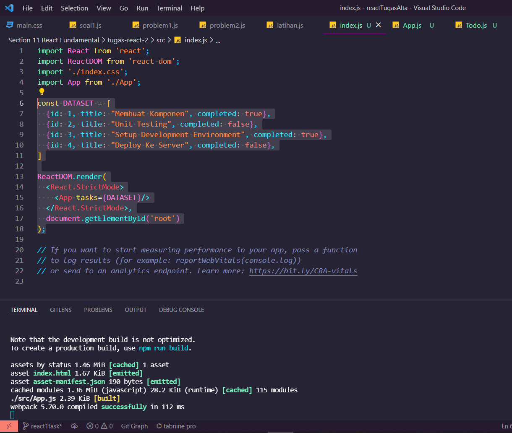
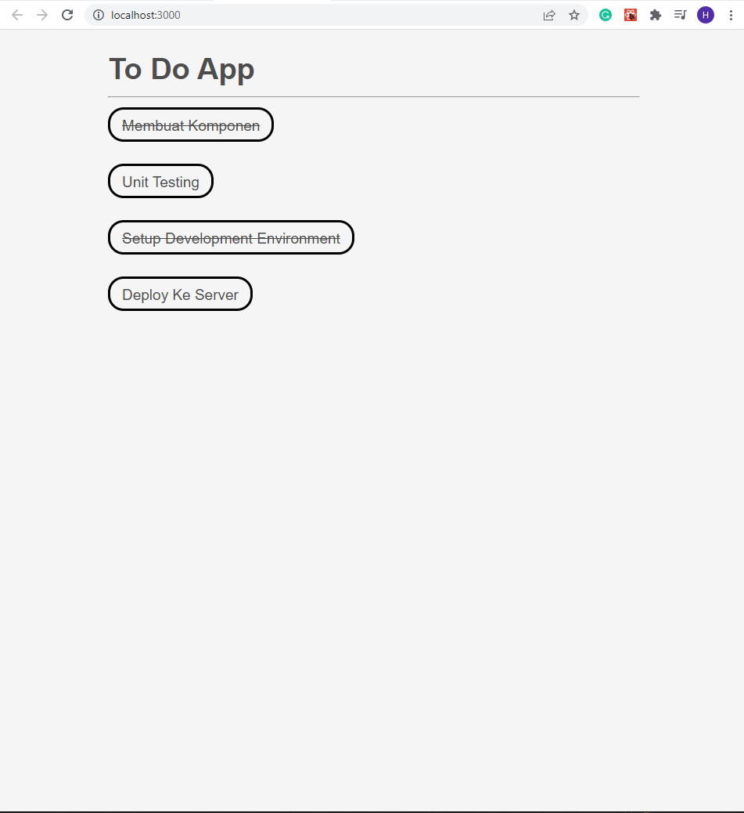

# React Fundamental

## Resume Materi
Dalam materi ini, mempelajari:
- [React Fundamental](#react-fundamental)
  - [Resume Materi](#resume-materi)
    - [1. What is JSX? and Why JSX?](#1-what-is-jsx-and-why-jsx)
      - [1.1 JSX VS React.createElement](#11-jsx-vs-reactcreateelement)
    - [2. React Component](#2-react-component)
      - [2.1 Component Props](#21-component-props)
      - [2.2 Render bersyarat dan list](#22-render-bersyarat-dan-list)
    - [3. React Lifecycle](#3-react-lifecycle)
      - [3.1 Penulisan Direktori Structure](#31-penulisan-direktori-structure)
  - [Task](#task)
    - [Membuat to do list dengan library react](#membuat-to-do-list-dengan-library-react)

### 1. What is JSX? and Why JSX?

JSX merupakan singkatan dari JavaScript XML merupakan ekstensi pada javascript yang penggunaannya sangat disarankan ketika menggunakan react karena lebih menggambarkan apa yang seharusnya tampak pada tampilan user interface. JSX akan menghasilkan suatu react element.

Alasan kita menggunakan JSX karean JSX dibuat berdasarkan fakta kalau logika rendering sangat terikat dengan logic UI, seperti bagaimana event ditangani, bagaimana state berubah seiring dengan waktu, dan bagaimana suatu data disiapkan untuk ditampilkan. Kalau biasanya kita memisahkan teknologi yang digunakan atau biasa disebut dengan Separation of technology yakni memisahkan marka dengan logika, maka dengan menggunakan react kita bisa menggabungkan kedua teknologi ini dan memisahkannya sesuai dengan kepentingan penggunaannya atau yang biasa disebut dengan Separation of concerns dengan sebuah unit gabungan terendah yang disebut dengan component.

#### 1.1 JSX VS React.createElement
Penggunaan JSX merupakan suatu hal yang opsional namun dengan menggunakannya dapat memudahkan kita untuk menulis aplikasi React dengan bantuan syntax yang biasa dikenal dengan Syntatic Sugar untuk fungsi React.createElement(component, props, ...children). Spesifikasi Jenis Elemen React bisa diperhatikan melalui penulisan tag yang digunakan. Penulisan komponen react menggunakan kapitalisasi dalam JSX sedangkan untuk tag bawaan atau default html menggunakan lowercase. Pada JSX kita juga bisa menaruh sebuah expression JS yang valid dalam isi suatu tag dengan menggunakan kurung kurawal. Selain itu, jika JSX digunakan untuk if for, maka JSX akan menjadi panggilan fungsi JS seperti biasa dan menjadi sebuah objek JS yang artinya variabel dalam if dan for tadi akan diterima sebagai argumen dan JSX akan mengembalikannya dari sebuah fungsi.

Penulisan atribut dalam JSX bisa diterapkan melalui dua hal yakni dengan menggunakan tanda kutip untuk menentukan string literal dan penggunaan kurung kurawal untuk menyematkan ekspresi JS. Selain itu react DOM menggunakan penulisan camelCase sebagai konvensi penamaan seperti contoh pada penulisan class diubah menjadi className. Dalam menuliskan sebuah tag jika tag tersebut kosong atau tidak memiliki elemen anak maka dalam JSX kita tidak perlu untuk menuliskan tag akhiran kedua namun bisa langsung menutupnya. Seperti contoh < img /> tidak perlu menjadi < img>< img />

### 2. React Component

Komponen react merupakan bagian kode yang dapat digunakan kembali yang digunakan untuk menentukan tampilan, behavior, dan state pada UI. Komponen bisa mempermudah kita untuk memecah UI menjadi bagian tersendiri, bagian yang bisa digunakan kembali dan berpikir tentang setiap potongan dalam isolasi. Dalam penggunaannya kita bisa membagi UI menjadi beberapa component pada tampilan website dengan menjadi sebuah hierarki komponen. Banyak cara yang bisa digunakan, salah satunya adalah mengkotak-kotakan komponen dan subkomponen dalam UI dengan penamaannya tersendiri. Lalu memutuskan mana yang menjadi komponen dan subkomponen yakni bagian yang lebih kecil. Kita dapat membuat suatu component dengan dua cara yakni dengan menggunakan function atau dengan menggunakan class yang mengextends react component. Cara membuat dan merender component dapat dilakukan dengan memanggil ReactDOM.render() dengan element yang akan ditampilkan.

#### 2.1 Component Props
Props merupakan singkatan dari properties yang berfungsi agar kita dapat untuk memberikan argument atau data pada component. Props juga membantu component yang kita buat menjadi lebih dinamis. Props dapat di passing ke component sama seperti memberikan atribut pada tag HTML. Sifat dari props dalam component adalah read-only dan tidak dapat diubah. Unidirectional Data Flow merupakan konsep yang diterapkan pada React dimana data cuma punya satu, dan hanya satu, cara untuk ditransfer ke bagian lain dari suatu aplikasi. Terdapat komposisi yang harus dimiliki dari komponen yakni adalah kontainmen dan spesialisasi. Kontainmen bisa dianggap seperti menyediakan / mempersiapkan sebuah space kosong yang bisa digunakan sesuai dengan kebutuhan sedangkan spesialisasi bisa dianggap penggunaan suatu props yang sudah spesifik dalam suatu komponen sehingga bisa langsung digunakan ketika komponen dipanggil.

#### 2.2 Render bersyarat dan list
Pada react kita juga bisa melakukan render untuk beberapa bagian saya berdasarkan state dari aplikasi dengan beberapa cara yakni:
1. Menggunakan kondisi if (misal lebih dari 2 contoh 5 komponen beda)
2. Menggunakan inline if dengan operator && (rekom)
3. Menggunakan inline if-else dengan ternary conditional operator (rekom)
4. Mencegah komponen untuk rendering

Selain render bersyarat terdapat hal yang cukup spesial ketika kita melakukan render list. Yakni kita dapat membangun koleksi dari beberapa elemen dan menyertakannya dalam JSX menggunakan tanda kurung kurawal {}. Dalam sebuah list yang akan dibuat diperlukan sebuah key yakni atribut string spesial yang perlu disertakan dengan fungsi untuk membantu React mengidentifikasi item mana yang telah diubah, ditambahkan, atau dihilangkan. Key biasanya diambil dari id suatu tag yang bersifat unik sehingga dapat digunakan fungsi map() untuk membantu pembuatan key, namun jika tidak ada id yang stabil untuk merender item maka bisa menggunakan indeks dari item sebagai key untuk pilihan terakhir yang penggunaannya kurang di rekomendasikan.

### 3. React Lifecycle
- Lifecycle umum
1. render() : fungsi yang paling sering dipakai, required pada class component, merupakan pure function atau tidak boleh ada setState() disini.
2. componentDidMount() : Dipanggil ketika component sudah di render untuk pertama kali, tempat yang tepat untuk pemanggilan API, boleh ada setState() disini.
3. componentDidUpdate() : Dipanggil ketika terjadi update props atau state berubah.
4. componentWillUnmount() : Dipanggil ketika component akan dihapus atau dihancurkan sehingga cocok digunakan untuk clean up actions.

- Lifecycle method lain
1. shouldComponentDidUpdate()
2. static getDerivedStateFromProps()
3. getSnapshotBeforeUpdate()

#### 3.1 Penulisan Direktori Structure
Karena file yang digunakan untuk membuat aplikasi pada folder src sangat banyak sehingga perlu adanya struktur yang dibuat untuk memudahkan pencarian file. Beberapa cara atau pendekatan yang dapat diterapkan adalah pengelompokan berdasarkan fitur atau rute dan pengelompokan berdasarkan jenis file. Kemudian beberapa hal yang juga bisa diterapkan adalah hindari terlalu banyak melakukan nesting file kedalam suatu folder. Selain itu juga ketika masih merasa kebingungan kita juga bisa menerapkan prinsip colocation sehingga memudahkan kita untuk mencari file yang sering berganti secara berdekatan antar satu sama lain.

## Task
### Membuat to do list dengan library react
Pada task ini, saya ditantang untuk membuat proyek todolist dengan library react dan memberikan hasil yang sesuai dengan data input contoh yang diberikan.

Berikut merupakan link repo halaman web menggunakan library react tersebut:
[Repo Tugas Praktikum React Fundamental Deny](https://github.com/denyFh/tugas-react/tree/master/Section%2011%20React%20Fundamental/tugas-react-2)

Berikut merupakan screenshot dari hasil tampilan website:

