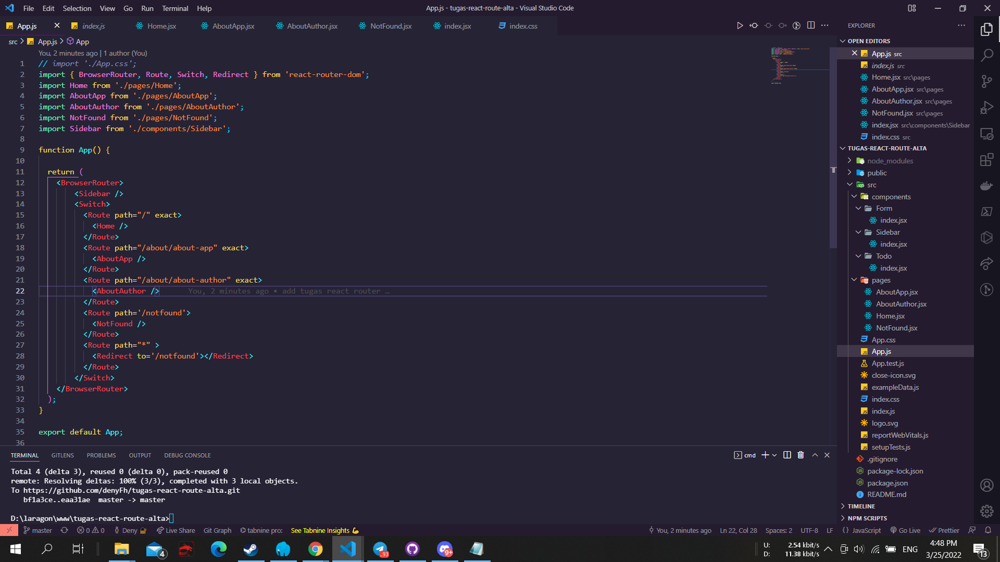

# React Routing

## Resume Materi
Dalam materi ini, mempelajari:
- [React Routing](#react-routing)
  - [Resume Materi](#resume-materi)
    - [1. Apa itu Router dalam ReactJS?](#1-apa-itu-router-dalam-reactjs)
    - [2. URL Param Usage in React](#2-url-param-usage-in-react)
    - [3. Hook Routing React](#3-hook-routing-react)
  - [Task](#task)
    - [Melanjutkan assignment React Route dalam membuat ToDoApp](#melanjutkan-assignment-react-route-dalam-membuat-todoapp)

### 1. Apa itu Router dalam ReactJS?
Router merupakan modul dalam react yang berfungsi untuk melakukan proses navigasi pada SPA (Single Page App). SPA merupakan kebalikan dari MPA (Multiple Page App) atau juga biasa dikenal dengan tradisional web app yang merupakan jenis aplikasi website dimana perlu memuat ulang seluruh halaman web setiap kali membuat permintaan baru. SPA merupakan jenis aplikasi website dimana hanya ada 1 halaman yang menangani semua aktivitas yang terjadi dalam aplikasi tersebut. Dengan masing-masing kekurangan yang dimiliki oleh tiap jenis halaman, dalam react kita dapat mempermudah proses routing dengan menggunakan react router library. Dengan menggunakan perintah:
"npm install react-router-dom --save"
Berikut beberapa komponen yang ada pada library react-router ini:
1. BrowserRouter: komponen yang digunakan sebagai router yang menggunakan API history dari HTML5 sehingga dapat menggunakan location untuk mengsinkronisasi UI dengan URL.
2. Switch: digunakan untuk membungkus kumpulan beberapa component route dengan bantuan property exact yang bertugas untuk memastikan route hanya merender component yang dituju pada path yang cocok.
3. Route: digunakan sebagai pengarah jalan suatu aplikasi web dengan menggunakan property path yang merupakan url pada browser pada proses routing dan property component yang berfungsi untuk menampilkan komponen yang diinginkan saat path / url diakses.
4. Link: digunakan untuk berpindah antar halaman, property to digunakan untuk merujuk pada path di route yang akan di tuju. 

### 2. URL Param Usage in React

Parameter URL adalah suatu parameter yang nilainya ditetapkan secara dinamis di URL Halaman. Cara mengakses param tersebut bisa dengan menggunakan "this.props.match.params". Link dan redirect itu mirip dengan tujuan untuk menavigasi dalam aplikasi namun terdapat perbedaan dalam kedua hal ini yakni:
- link dapat digunakan dalam kondisi apapun sedangkan redirect biasanya digunakan sebagai pengalihan 
- link memberikan history baru pada browser sedangkan redirect menimpa history pada browser
- link bereaksi mirip dengan tag anchor pada html sedangkan redirect bereaksi dengan suatu kondisi.

### 3. Hook Routing React
Hooks pada react router terdapat 4 fungsi diantaranya:
1. useHistory: memberikan akses ke instance riwayat yang dapat digunakan untuk bernavigasi, contoh history.length/go/goBack/goForward/push/replace.
2. useLocation: digunakan untuk mengembalikan objek lokasi yang mewakili URL saat ini.
3. useParams: digunakan untuk mengembalikan objek pasangan kunci/nilai parameter URL, biasa digunakan untuk mengakses match.params dari Route saat ini.
4. useRouteMatch: digunakan untuk mencoba mencocokkan URL saat ini dengan cara yang sama seperti Route.

## Task
### Melanjutkan assignment React Route dalam membuat ToDoApp
Pada task ini, saya ditantang untuk menambahkan react route kedalam todoapps yang sudah dibuat dengan react pada tugas sebelumnya dan memberikan hasil yang sesuai dengan contoh yang diberikan.

Berikut merupakan link repo untuk tugas tersebut:
[Repo Tugas Praktikum React Router Deny](https://github.com/denyFh/tugas-react-route-alta)

Berikut merupakan screenshot dari hasil tampilan website:

