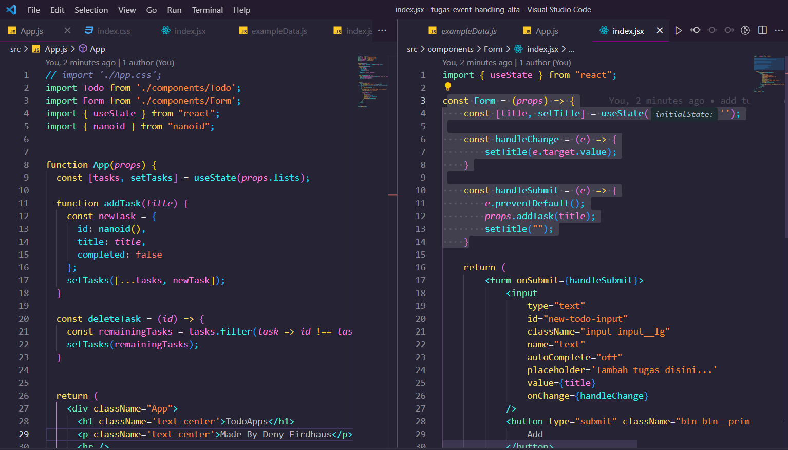

# Event Handling

## Resume Materi
Dalam materi ini, mempelajari:
- [Event Handling](#event-handling)
  - [Resume Materi](#resume-materi)
    - [1. State pada React](#1-state-pada-react)
    - [2. Statefull - Stateless](#2-statefull---stateless)
    - [3. Event Handling pada React](#3-event-handling-pada-react)
  - [Task](#task)
    - [Membuat todoapp dengan library react menerapkan event handling](#membuat-todoapp-dengan-library-react-menerapkan-event-handling)

### 1. State pada React
State adalah data private sebuah component. Data nii hanya tersedia untuk component tersebut dan tidak bisa diakses dari component lain. Beberapa poin perhatian pada state react yakni:
1. Data yang bisa dimodifikasi menggunakan setState
2. Setiap terjadi modifikasi akan terjadi render ulang
3. Bersifat Async
4. Dipakai dalam class
Berikut merupakan perbedaan antara props dan state:
1. Props hanya bersifat read-only, sedangkan perubahan state bisa berupa async
2. Props tidak bisa di modifikasi sedangkan state bisa di modifikasi menggunakan this.setState

### 2. Statefull - Stateless
Stateful component adalah komponen yang memiliki state sebelum versi terbaru, komponen ini hanya bisa dibuat dengan class dengan kelebihannya adalah memiliki lifecycle. Stateless component adalah komponen yang tidak memiliki state hanya props, umumnya komponen ini dibuat dengan menggunakan function karena lebih ringkas.
Komponen stateful dan stateless memiliki banyak nama berbeda diantaranya:
- Smart component & Dump component
- Container component & Presentational component
Perbedaan dari komponen stateful dan komponen stateless yakni:
1. Stateless tidak tahu tentang aplikasi sedangkan stateful mengerti tentang aplikasi
2. Stateless tidak melakukan data fetching namun stateful melakukannya
3. Stateless tujuan utamanya adalah visualisasi sedangkan stateful tujuannya untuk berinteraksi dengan aplikasi
4. Stateless dapat digunakan kembali sedangkan stateful tidak dapat digunakan kembali
5. Stateless hanya berkomunikasi dengan induk atau parent langsungnya namun stateful meneruskan status dan data ke anak atau childnya.

### 3. Event Handling pada React
Handling event merupakan suatu metode yang digunakan untuk menangani sebuah event/aksi yang diberikan pengguna kepada suatu komponen. Event sendiri merupakan suatu peristiwa yang dipicu oleh pengguna pada suatu komponen misalnya ketika pengguna menekan tombol, form di submit. Untuk penulisannya mirip dengan HTML. Beberapa contoh list event:
1. Clipboard events (promise terpenuhi)
2. Form Events (onChange, onSubmit)
3. Mouse Events (onClick, onDoubleClick, onMouseOver)
4. Generic Events (onError, onLoad)

## Task
### Membuat todoapp dengan library react menerapkan event handling
Pada task ini, saya ditantang untuk membuat proyek dengan library react menerapkan event handling.

Berikut merupakan link repo untuk tugas tersebut:
[Repo Tugas Praktikum Event Handling Deny](https://github.com/denyFh/tugas-event-handling-alta)

Berikut merupakan screenshot dari hasil tampilan website:

