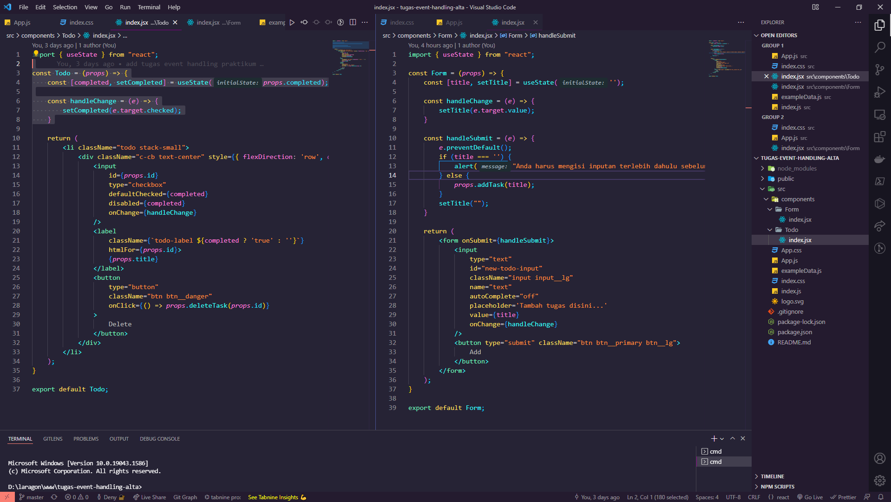

# React Hook

## Resume Materi
Dalam materi ini, mempelajari:
- [React Hook](#react-hook)
  - [Resume Materi](#resume-materi)
    - [1. Apa itu React Hooks](#1-apa-itu-react-hooks)
    - [2. Implementasi useState dan useEffect](#2-implementasi-usestate-dan-useeffect)
    - [3. Create Custom Hooks](#3-create-custom-hooks)
  - [Task](#task)
    - [Mengubah proyek todoapp yang telah dibuat](#mengubah-proyek-todoapp-yang-telah-dibuat)

### 1. Apa itu React Hooks
Hooks merupakan fitur baru di react 16.8. Dengan hooks, kita dapat menggunakan state dan fitur react lain tanpa perlu menulis sebuah kelas. Alasan adanya react hooks diantaranya adalah kesulitan untuk menggunakan kembali stateful logic antar komponen, komponen kompleks menjadi sulit untuk dimengerti, dan kelas membingungkan manusia dan mesin. Beberapa hooks dasar yang biasa digunakan diantaranya:
- useState
- useEffect
- useContext
Ada pula beberapa hooks tambahan diantaranya:
- useReducer
- useCallback
- useMemo
- useRef
- useImperativeHandle
- useLayoutEffect
- useDebugValue

Aturan dalam hooks diantaranya:
- Hanya panggil hooks di tingkat atas pada function yang digunakan.
- Hanya panggil hooks dari fungsi fungsi react.

### 2. Implementasi useState dan useEffect
Salah satu hal yang perlu diperhatikan bahwa hooks hanya dapat digunakan pada function component dan tidak dapat digunakan pada class component. useEffect merupakan effect hook yang memungkinkan kita melakukan efek samping di dalam function component, seperti componentDidMount, componentDidUpdate, componentWillUnmount mirip dengan useEffect. Bisa dibilang bahwa useEffect ini yang menggantikan lifecycle pada react component. Terdapat dua jenis useEffect yakni yang membutuhkan pembersihan dan yang tidak membutuhkan pembersihan.
cara penggunaan useState:
- import useState
- deklarasi sebuah variabel yang berisikan nama state (variabel) dan set nama state (fungsi pembaru) yang dibuat dengan nilai setState awal yang diinginkan seperti contoh 0 atau string kosong ataupun null.
- panggil variabel yang akan digunakan dengan menggunakan curly brace
- ketika akan melakukan pengubahan nilai state maka bisa dnegan menggunakan set nama state kemudian isikan nilai baru yang akan di assign.

cara penggunaan useEffect:
- pada penerapan efek tanpa pembersihan:
- useEffect digunakan tanpa merubah kembali suatu state hanya menampilkan saja
- pada penerapa efek dengan pembersihan
- useEffect digunakan dengan merubah suatu nilai sebuah state setelah menampilkannya

performa dalam penggunaan useEffect dapat dicapai dengan menggunakan dua cara yakni:
- dengan menggunakan condition 
- atau dengan menambahkan suatu argumen dalam useEffect yang berisikan array yang berkaitan.

### 3. Create Custom Hooks
Custom hooks yakni kita membuat hook sendiri yang memungkinkan kita dapat mengekstrak komponen logika ke fungsi yang dapat digunakan lagi. Caranya adalah dalam suatu function yang ingin digunakan kembali maka dapat melakukan return state yang ada pada function tersebut kemudian memanggilnya ke dalam function lain dengan menggunakan import sehingga nanti function tersebut akan mereturn suatu nilai state yang bisa dipakai kembali.

## Task
### Mengubah proyek todoapp yang telah dibuat
Pada task ini, saya ditantang untuk membuat proyek dengan library react menerapkan react hooks.

Berikut merupakan link repo untuk tugas tersebut:
[Repo Tugas Praktikum React Hooks Deny](https://github.com/denyFh/tugas-react-hooks-alta)

Berikut merupakan screenshot dari hasil tampilan website:

