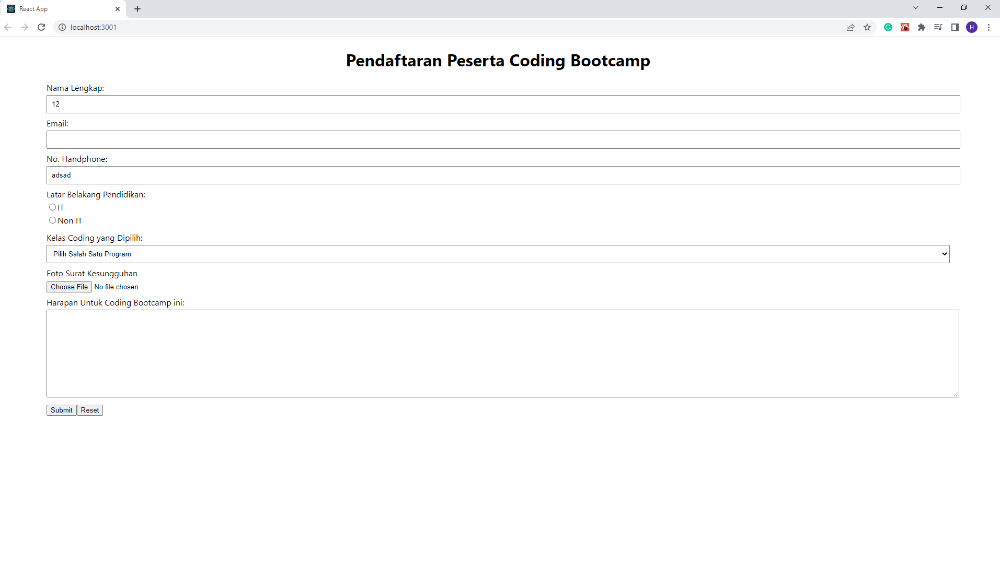

# React Forms

## Resume Materi
Dalam materi ini, mempelajari:
- [React Forms](#react-forms)
  - [Resume Materi](#resume-materi)
    - [1. Penggunaan dan Macam Form](#1-penggunaan-dan-macam-form)
    - [2. Controlled Component & Uncontrolled Component](#2-controlled-component--uncontrolled-component)
    - [3. Basic Validation](#3-basic-validation)
  - [Task](#task)
    - [Mengubah proyek todoapp yang telah dibuat](#mengubah-proyek-todoapp-yang-telah-dibuat)

### 1. Penggunaan dan Macam Form

### 2. Controlled Component & Uncontrolled Component

### 3. Basic Validation

## Task
### Mengubah proyek todoapp yang telah dibuat
Pada task ini, saya ditantang untuk membuat proyek dengan library react menerapkan react forms dan validation.

Berikut merupakan link repo untuk tugas tersebut:
[Repo Tugas Praktikum React Hooks Deny](https://github.com/denyFh/tugas-react-form-alta)

Berikut merupakan screenshot dari hasil tampilan website:

