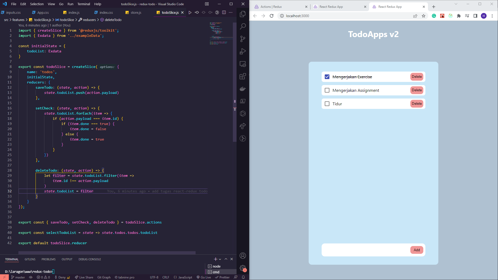

# Global State Management

## Resume Materi
Dalam materi ini, mempelajari:
- [Global State Management](#global-state-management)
  - [Resume Materi](#resume-materi)
    - [1. Global State Introduction](#1-global-state-introduction)
    - [2. Redux Thunk and Persisted State](#2-redux-thunk-and-persisted-state)
    - [3. Fetching Data](#3-fetching-data)
  - [Task](#task)
    - [Membuat proyek todoapp yang telah dibuat sebelumnya dengan redux](#membuat-proyek-todoapp-yang-telah-dibuat-sebelumnya-dengan-redux)

### 1. Global State Introduction

### 2. Redux Thunk and Persisted State

### 3. Fetching Data

## Task
### Membuat proyek todoapp yang telah dibuat sebelumnya dengan redux
Pada task ini, saya ditantang untuk membuat proyek todoapp dengan library react, redux-toolkit, dan react-redux serta react-persist.

Berikut merupakan link repo untuk tugas tersebut:
[Repo Tugas Praktikum Global State Management Deny](https://github.com/denyFh/redux-todo)

Berikut merupakan screenshot dari hasil tampilan website:

