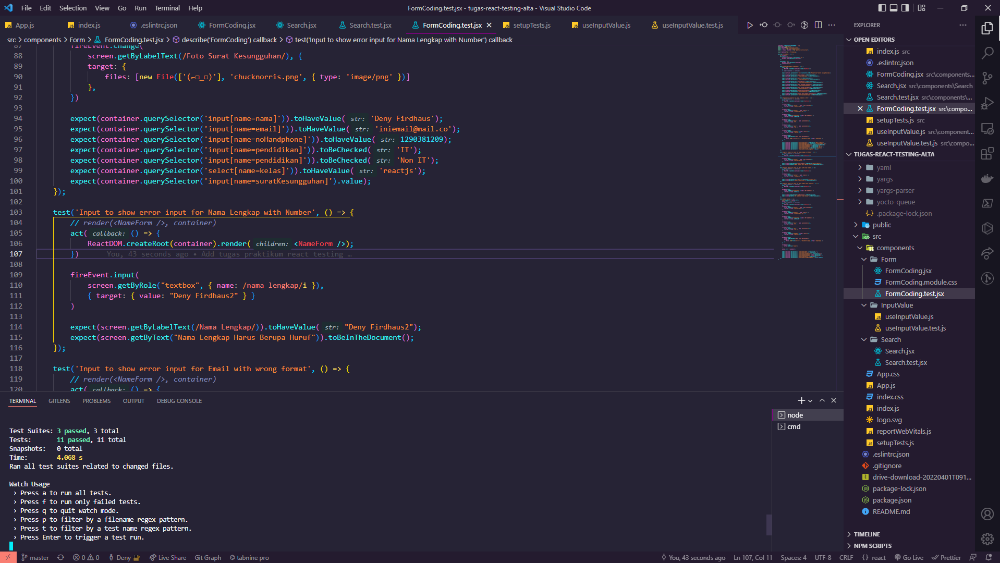

# Testing

## Resume Materi
Dalam materi ini, mempelajari:
- [Testing](#testing)
  - [Resume Materi](#resume-materi)
    - [1. Basic Testing](#1-basic-testing)
    - [2. Basic Testing with RTL](#2-basic-testing-with-rtl)
    - [3. Testing Custom Hook](#3-testing-custom-hook)
  - [Task](#task)
    - [Membuat file testing dari asset yang telah diberikan](#membuat-file-testing-dari-asset-yang-telah-diberikan)

### 1. Basic Testing
Testing merupakan proses memverifikasi bahwa test assertions kita benar dan bahwa code kita tetap benar sepanjang masa aplikasi. Test assertion ini adalah ekspresi boolean yang mengembalikan nilai true kecuali ada bug di kode kita. Adapun beberapa manfaat testing diantaranya:
- Mempuyai coverage yang baik sehingga membuat kita percaya akan aplikasi yang dibuat dan langsung mengetahui error yang dialami ketika kita melakukan perubahan pada beberapa bagian sehingga dapat langsung menuju ke permasalahannya.
- Mengurangi bug pada aplikasi

Cara testing di React terbagi menjadi dua kategori: 
1. Rendering component trees
2. Menjalankan aplikasi dengan lengkap

Beberapa rekomendasi tools yang bisa digunakan untuk melakukan testing pada react diantaranya:
- Jest : test runner pada JS dengan mengakses DOM melalui jsdom dengan kecepatan iterasi yang bagus dan fungsi yang cukup powerful
- RTL (React Testing Library) : Merupakan seperangkat helpers yang memungkinkan kita untuk melakukan pengetasan tanpa bergantung pada detail implementasinya.
- Install : jika menginstall react dengan menggunakan CRA (create react app) maka kedua tools tersebut akan langsung ada pada folder react kita.

### 2. Basic Testing with RTL
Dalam RTL terdapat beberapa fungsi yang sering digunakan untuk melakukan suatu testing yakni adalah fungsi render untuk merender file jsx yang dibutuhkan kemudian terdapat fungsi debug yang digunakan untuk memastikan bahwa file jsx telah berhasil dirender.

Beberapa elemen kategori testing yang bisa digunakan diantaranya:
- LabelText
- PlaceholderText
- AltText
- DisplayValue

Kita juga bisa mentesting suatu handle event dengan menggunakan fireEvent yang disediakan RTL yang kemudian dicocokan dengan role event yang ingin ditesting dan memberikan suatu value testing yang kemudian di expect untuk tampil atau muncul ketika di test.

Selain itu kita juga bisa mentesting handle asynchronous untuk kasus seperti mengetes fetch sebuah API dengan bantuan axios atau yang lain kemudian mereturn sebuah mock promise yang akan di cocokan dengan skenario yang dibuat.

### 3. Testing Custom Hook
Selain melakukan testing pada komponen react, kita juga bisa melakukan testing custom hook yang telah kita buat dnegan menggunakan bantuan library React Hooks Testing Library yakni alat yang digunakan untuk mengetes hooks tanpa merender suatu komponen. 

## Task
### Membuat file testing dari asset yang telah diberikan 
Pada task ini, saya ditantang untuk membuat file testing dan membuat skenario testing berdasarkan asset yang telah disediakan.

Berikut merupakan link repo untuk tugas tersebut:
[Repo Tugas Praktikum React Testing Deny](https://github.com/denyFh/tugas-react-testing-alta)

Berikut merupakan screenshot dari hasil tampilan website:

