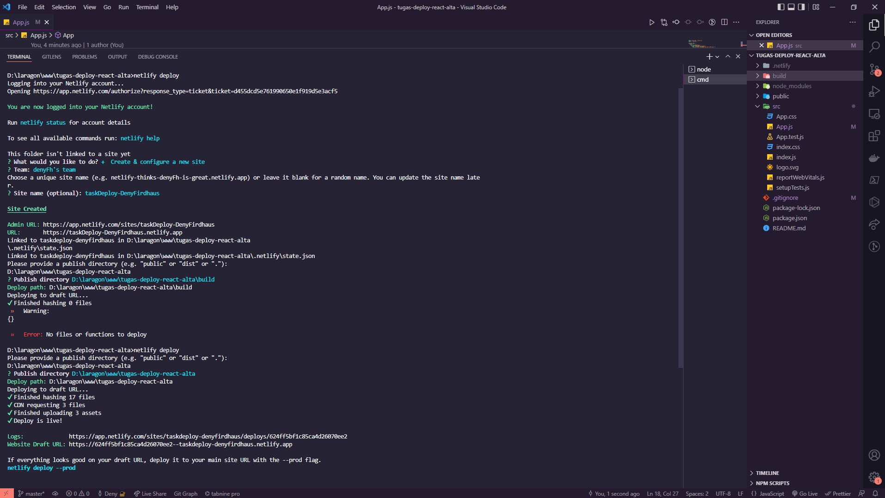
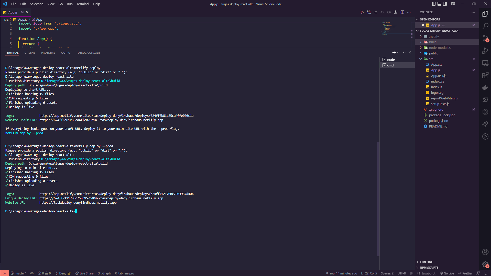
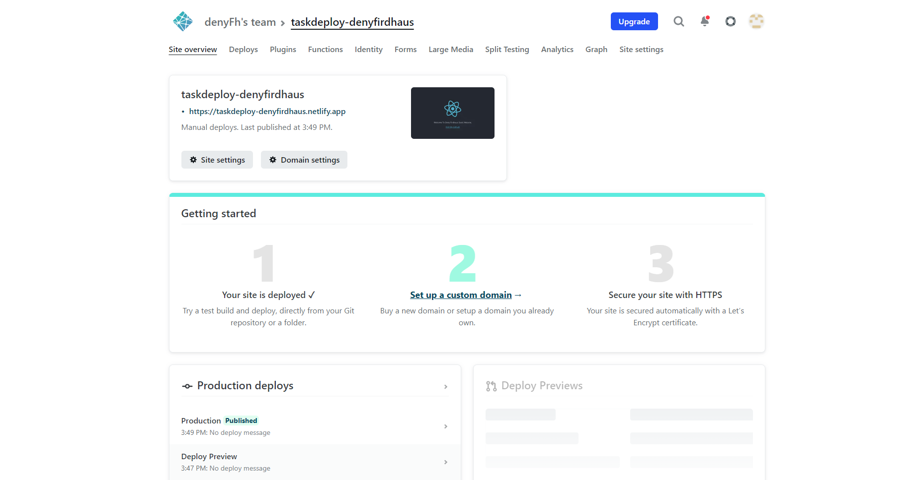

# Deployment

## Resume Materi
Dalam materi ini, mempelajari:
- [Deployment](#deployment)
  - [Resume Materi](#resume-materi)
    - [1. Build React App](#1-build-react-app)
    - [2. Deployment dengan Surge](#2-deployment-dengan-surge)
    - [3. Deployment dengan Netlify CLI](#3-deployment-dengan-netlify-cli)
  - [Task](#task)
    - [Melakukan deploy suatu react app statis](#melakukan-deploy-suatu-react-app-statis)

### 1. Build React App
Secara default ketika menginisialisasi, react akan mengandung banyak pesan peringatan yang berguna dalam pengembangan aplikasi namun, membuat react menjadi lebih besar dan lambat. Sehingga diperlukan versi produksi (build) ketika melakukan deploy aplikasi dengan menggunakan react. Caranya:
- run command npm run build
maka akan terbuat folder build yang digunakan untuk melakukan deploy.

### 2. Deployment dengan Surge
Deployment merupakan kegiatan yang bertujuan untuk menyebarkan aplikasi yang sudah dibuat dengan harapan bisa diakses oleh banyak orang. Terdapat banyak cara untuk melakukan deploy diantaranya dengan menggunakan Surge yakni layanan static web publishing gratis bagi para front-end developers. Cara melakukan deploy dengan Surge:
- run command npm install --global surge
- run command surge
- masukkan kredibilitas yang dibutuhkan kedalam akun surge
- lakukan publish domain untuk folder build

### 3. Deployment dengan Netlify CLI
Selain dengan menggunakan layanan Surge, terdapat layanan gratis lainnya seperti Netlify untuk melakukan deployment terhadap aplikasi kita. Selain itu Netlify sudah terintegrasi dengan Git Host seperti Github, Gitlab, dan Bitbucket yang dapat mempermudah proses setup deployment kita. Cara melakukan deploy dengan Netlify CLI:
- run command npm install netlify-cli -g
- run command netlify deploy
- kemudian akan diarahkan ke akun netlify yang terhubung untuk melakukan autorisasi
- lakukan create & configure a new site
- masukkan site name yang diinginkan (bersifat opsional)
- pilih folder build yang sudah dibuat untuk menjadi lokasi file yang akan di deploy

## Task
### Melakukan deploy suatu react app statis
Pada task ini, saya ditantang untuk melakukan deployment react app statis kedalam Surge/Netlify.

Berikut merupakan link repo untuk tugas tersebut:
[Repo Tugas Praktikum React Deployment Deny](https://github.com/denyFh/tugas-deploy-react-alta)

Berikut merupakan screenshot dari hasil tampilan website:

