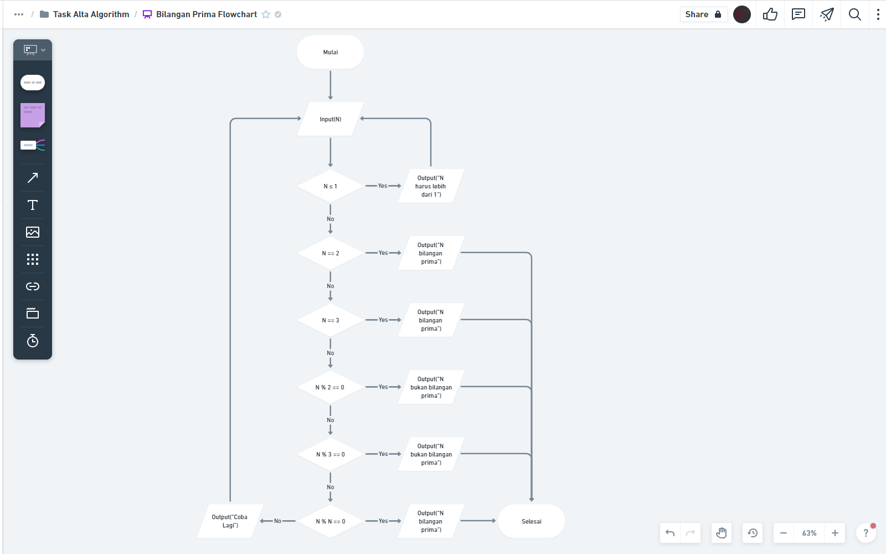
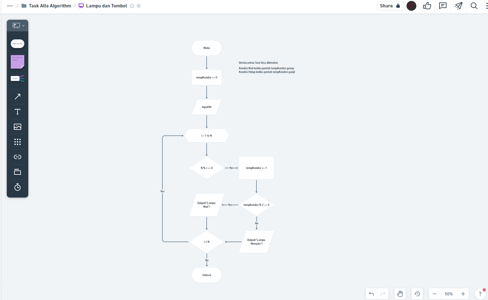

# Introduction Algorithm

## Resume Materi
Dalam materi ini, mempelajari:
- [Introduction Algorithm](#introduction-algorithm)
  - [Resume Materi](#resume-materi)
    - [1. What is Algorithm?](#1-what-is-algorithm)
    - [2. What is Pseudo Code?](#2-what-is-pseudo-code)
    - [3. What is Flowchart?](#3-what-is-flowchart)
  - [Task](#task)
    - [Membuat flowchart sesuai dengan problem yang tersedia](#membuat-flowchart-sesuai-dengan-problem-yang-tersedia)

### 1. What is Algorithm?
Algoritma merupakan prosedur komputasi yang didefinisikan dengan baik yang mengambil beberapa nilai sebagai input yang kemudian diolah dan menghasilkan beberapa nilai sebagai output. Beberapa contoh penggunaan algoritma:
- Melakukan pengecekan dalam bilangan prima
- Melakukan sorting
- Membuat fitur searching

Beberapa karakteristik algoritma:
- Memiliki batas (awal dan akhir)
- Intruksi terdefinisi dengan baik
- Efektif & efisien

Algoritma dasar terdiri dari 3 bentuk yakni:
- Sequential
- Branching
- Looping

### 2. What is Pseudo Code?
Pseudo Code merupakan sebuah langkah-langkah yang bisa kita buat dalam membentuk suatu algoritma. Biasanya pseudo code dibuat dengan menggunakan bahasa yang manusia mudah mengerti yang kemudian nanti akan dikonversikan menjadi suatu kode.

### 3. What is Flowchart?
Flowchart merupakan suatu bagan dengan simbol tertentu yang menggambarkan urutan dan hubungan antar proses secara mendetail. Flowchart dapat digunakan sebagai bentuk visualisasi dari algoritma yang sudah kita susun dengan ataupun tidak dengan menggunakan pseudo code. Adapun beberapa penjelasan mengenai bentuk / simbol dalam flowchart:
- rounded rectangle : Poin Mulai / selesai
- rectangle : memuat suatu proses
- jajar genjang : memberikan suatu input/output
- belah ketupat : penggambaran suatu kondisi (if statement)
- hexagonal : penggambaran suatu bentuk perulangan (looping)

## Task
### Membuat flowchart sesuai dengan problem yang tersedia
Pada task ini, saya ditantang untuk membuat suatu flowchat untuk menjawab dua permasalahan yakni Bilangan prima dan Lampu & Tombol.

Berikut merupakan link untuk tugas tersebut:
[Link Tugas Praktikum Introduction Algorithm Deny](https://whimsical.com/task-alta-algorithm-EaKZfvqyx4q2bLAMoyMLTB)

Berikut merupakan screenshot dari hasil tampilan website:

