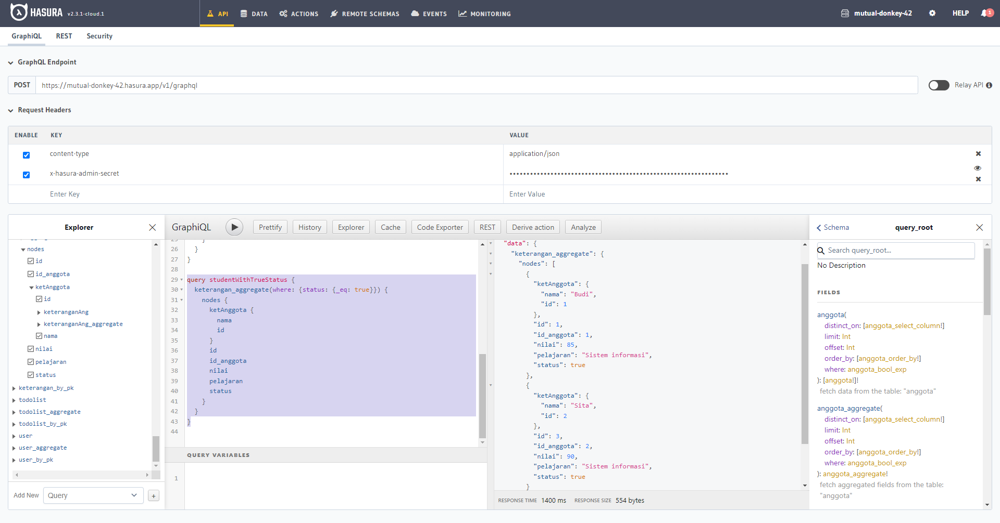
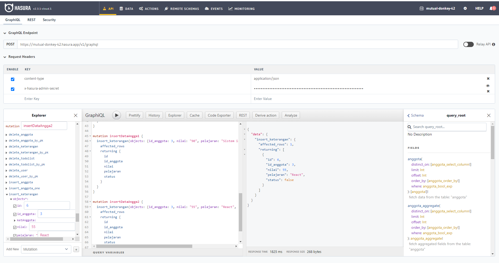
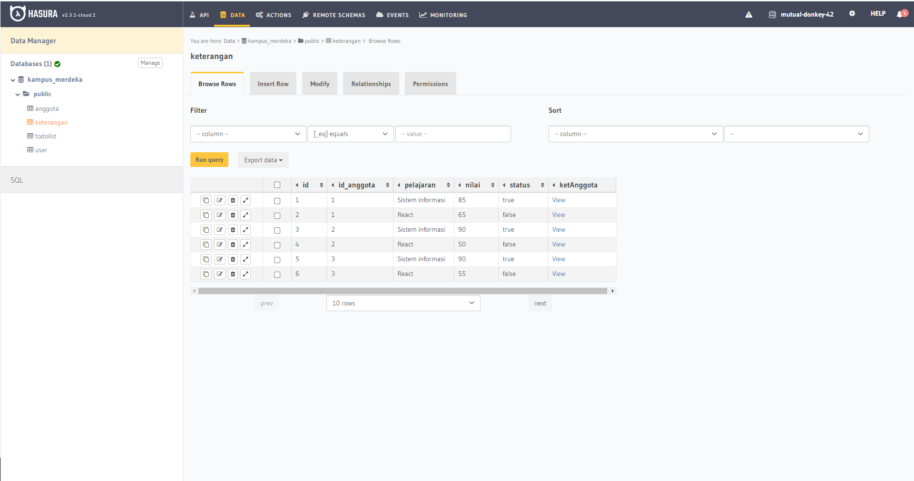
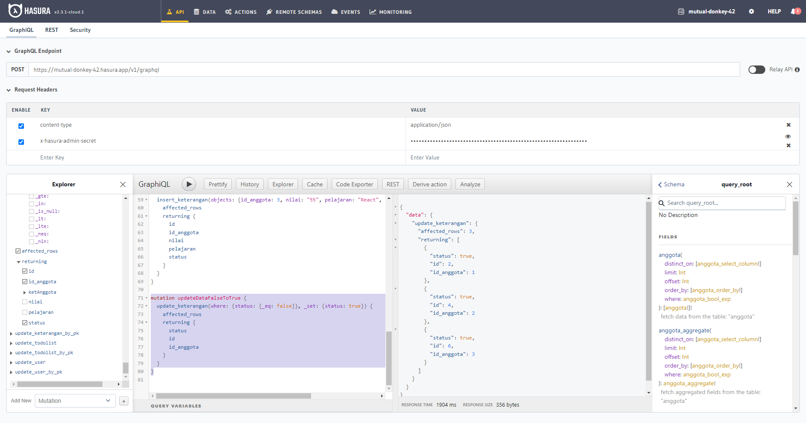

# GraphQL - Basic

## Resume Materi
Dalam materi ini, mempelajari:
- [GraphQL - Basic](#graphql---basic)
  - [Resume Materi](#resume-materi)
    - [1. What is GraphQL?](#1-what-is-graphql)
    - [2. Hasura, Heroku, Apollo](#2-hasura-heroku-apollo)
    - [3. Command for GraphQL](#3-command-for-graphql)
  - [Task](#task)
    - [Membuat database dan melakukan mutation](#membuat-database-dan-melakukan-mutation)

### 1. What is GraphQL?
GraphQL merupakan suatu query language untuk API, dan merupakan sebuah server-side runtime untuk mengeksekusi suatu query dengan menggunakan tipe sistem yang kita deifiniskan untuk data kita. GraphQL mengurangi jumlah data yang diperlukan untuk ditransfer melalui suatu network / jaringan. Dengan GraphQL kita bisa menggunakan satu endpoint untuk menghandle request yang dibutuhkan dalam aplikasi. Terdapat 3 fitur utama pada GraphQL client diantaranya:
1. Query, mendapatkan data berdasarkan query spesifik yang kita definisikan
2. Mutation, melakukan insert, update, dan delete data
3. Subscription, mendapatkan tanggal dan waktu secara realtime atau berdasarkan suatu events

### 2. Hasura, Heroku, Apollo
Hasura merupakan suatu penyedia jasa graphql dan rest api, yang secara penuh dimanajemen dalam suatu cloud ataupun bisa untuk self-hosted. Heroku merupakan cloud platform yang berfungsi sebagai jasa yang mensupport beberapa programming languages beserta menyediakan postgres database gratis. Dalam pembelajaran kali ini saya diperlukan untuk membuat akun pada kedua platform ini agar bisa mengikuti kegiatan pembelajaran. Setelah selesai melakukan pembuatan akun, maka saya baru bisa melakukan query dan mutation dalam Hasura Cloud.

Apollo Client merupakan suatu comprehensive state management library untuk JS yang memungkinkan kita untuk memanajemen baik local dan remote data dengan GraphQL. Cara mengkonfigurasi apollo yakni pertama dengan menginstallnya kedalam node modules kita. Kemudian kita membuat file appolo client yang dihubungkan dengan endpoint dan secret key yang sudah dimiliki. Lalu tambahkan apollo client kedalam index js sebagai apollo provider.

### 3. Command for GraphQL
Dalam graphql terdapat beberapa cara pemanggilan data yang bisa digunakan diantaranya:
- useQuery melakukan eksekusi query dari database yang sudah kita buat dalam hasura
- useLazyQuery melakukan eksekusi query sesuai dengan event / function yang kita deifinisikan
- useMutation melakukan eksekusi query untuk melakukan insert/delete/update pada data dalam database kita
- untuk melakukan subscription kita perlu untuk menginstall library add-ons yakni @apollo/client subscriptions-transport-ws, kemudian melakuakn setting tambahan dalam file apollo client kita untuk menambahkan websocket link dan membuat suatu function split yang menggabungkan penggunaan antara websocket link dan http link sesuai dengan tipe kebutuhan. Barulah kita bisa menggunakan subscription pada query graphql pada apollo.

## Task
### Membuat database dan melakukan mutation
Pada task ini, saya ditantang untuk membuat suatu database beserta datanya sesuai dengan instruksi yang diberikan kan melakukan query mutation untuk mendapatkan hasil yang diinginkan.

Berikut merupakan link untuk tugas tersebut:
[Link Tugas Praktikum Introduction Algorithm Deny](https://github.com/denyFh/tugas-graphql-basic-alta/blob/master/hasuracmd.json)

Berikut merupakan screenshot dari hasil tampilan website:

