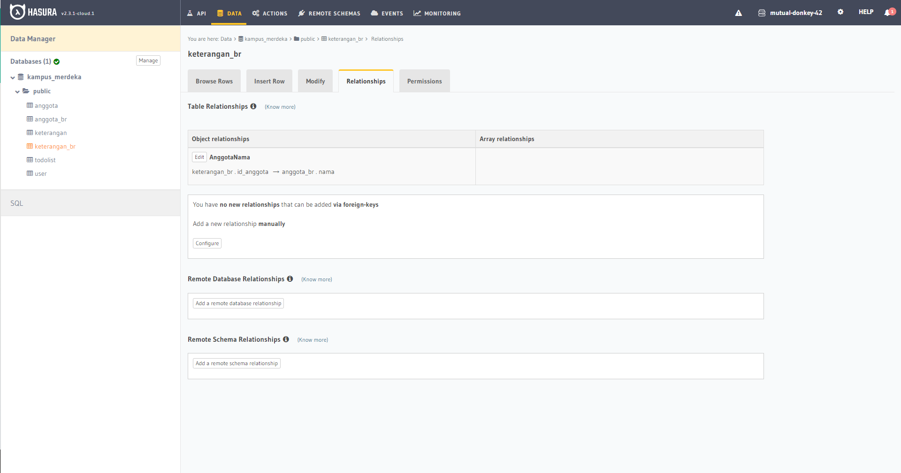

# Relational Database

## Resume Materi
Dalam materi ini, mempelajari:
- [Relational Database](#relational-database)
  - [Resume Materi](#resume-materi)
    - [1. Database and Relations](#1-database-and-relations)
    - [2. MySQL and Commands](#2-mysql-and-commands)
    - [3. Rules in Database](#3-rules-in-database)
  - [Task](#task)
    - [Membuat relationship dalam table hasura](#membuat-relationship-dalam-table-hasura)

### 1. Database and Relations
Database merupakan sekumpulan data yang terorganisir. Dalam suatu database terdapat relationship yang menghubungkan antar tabel diantaranya one to one, one to many, dan many to many. One to one berarti satu baris data hanya dapat berhubungan dengan satu baris data pada tabel lain. one to many berarti satu baris data dapat berhubungan dengan satu atau lebih baris data pada tabel lain, sedangkan many to many berarti bahwa satu atau lebih baris data dapat dimiliki oleh satu atau lebih baris data pada tabel lain. Contoh many to many relationship seperti 1 mahasiswa bisa memiliki banyak mata kuliah, 1 mata kuliah bisa diambil oleh banyak mahasiswa.

### 2. MySQL and Commands
Untuk melakukan pengaturan database, diperlukan suatu RDBMS atau Relational Database Management Systems dengan menggunakan software yang menggunakan relational database model sebagai dasarnya seperti MySQL. Adapun beberapa command yang bisa digunakan dalam SQL diantaranya CREATE DATABASE, CREATE TABLE, DROP TABLE, RENAME TABLE, dan lain sebagainya. Beberapa tipe data yang ada pada mysql diantaranya adalah num, huruf, dan date. 

Selain itu terdapat DML atau Data Manipulation Language yang digunakan untuk memanipulasi data dalam tabel dari suatu database, diantaranya pada suatu statement operation seperti INSERT, SELECT, UPDATE, dan DELETE, dapat digunakan DML Statement seperti LIKE/BETWEEN, AND/OR, ORDER BY, dan LIMIT.
### 3. Rules in Database
Terdapat beberapa peraturan yang perlu diterapkan ketika menggunakan atau menulis suatu SQL diantaranya yakni command harus tertutup dalam tanda kurung, subquery hanya dapat memiliki satu kolom pada klausa SELECT, subqueries yang kembali lebih dari satu baris hanya dapat digunakan dengan beberapa value operator seperti IN, daftar SELECT tidak bisa menyertakan referensi ke nilai-nilai yang mengevaluasi ke BLOB, ARRAY, CLOB, atau NCLOB, dan sebuah subquery tidak dapat segera tertutup dalam fungsi set.

## Task
### Membuat relationship dalam table hasura
Pada task ini, saya ditantang untuk membuat suatu relationship antar tabel sesuai dengan instruksi yang diberikan.

Berikut merupakan screenshot dari hasil tampilan website:

