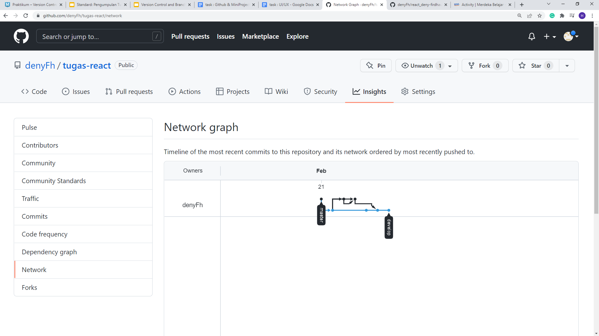

# Version Control and Branch Management (Git)

## **Resume Materi**
- [Version Control and Branch Management (Git)](#version-control-and-branch-management-git)
  - [**Resume Materi**](#resume-materi)
    - [1.	Introduction to Git and Github](#1introduction-to-git-and-github)
      - [Version Control System (VCS)](#version-control-system-vcs)
      - [More About Git and Github](#more-about-git-and-github)
    - [2.	Learning Git commands and starting in Github](#2learning-git-commands-and-starting-in-github)
      - [Membuat repository di github :](#membuat-repository-di-github-)
      - [More about Github utils](#more-about-github-utils)
      - [Staging area](#staging-area)
      - [More about git commands](#more-about-git-commands)
    - [3.	Workflow Collaboration](#3workflow-collaboration)
  - [Task](#task)
    - [Mempelajari Repo dan Macam perintah](#mempelajari-repo-dan-macam-perintah)

### 1.	Introduction to Git and Github
Versioning : melakukan sebuah pengaturan versi atau pelacakan perubahan dari setiap code program. *Untuk apa melakukan versioning?* digunakan untuk mentracking terkait permasalahan baik itu pengubahan objek kode atau seseorang yang melakukan perubahan. Sehingga penting saat ini untuk menggunakan VCS (Versioning Control System) seperti Github. Tools yang bisa dipakai VCS, SCM, dan RCS. 

#### Version Control System (VCS)
1.	Single User : bentuk versioning masih localized
2.	Centralized : ada sistem terpusat bagi banyak developer bisa melakukan pengubahan file di server secara langsung. 
3.	Distributed : merupakan gabungan, terdapat file local yang tersinkronisasi dengan file yang ada di server / central / pusat data.

#### More About Git and Github

- GIT : salah satu contoh VCS Distributed yang digunakan developer untuk mengembangkan software secara bersama-sama / kolaborasi. 

- Git Repository : sebuah folder project di github untuk menyimpan local files yang telah di upload ke server. Didalamnya terdapat 2 hal folder dan file kode serta folder .git yang sifatnya terhidden yang berisikan mengenai Riwayat commit dan perubahan yang dilakukan pada kode.

- Github = git hosting service, yang dianggap sebagai sosmed developer dan menjadi sebuah tempat untuk menampung proyek git serta mempermudah dalam meng-hosting di server tanpa susah payah harus men-setup / konfigurasi server git. 

### 2.	Learning Git commands and starting in Github
#### Membuat repository di github :
-	Membuat akun di github sampai verifikasi
-	Menuju ke ”your repositories”
-	Membuat repo baru
-	Mengisi nama repo
-	Memberikan deskripsi
-	Memilih jenis repo (public / private)
-	Tambahkan readme file sebagai dokumentasi penting 

#### More about Github utils
-	.gitignore : digunakan untuk mengecualikan file besar, contoh pada proyek node-js akan ada folder node_modules yang sangat besar dan sangat tidak disarankan untuk diupload ke server, dan file seperti .env yang tidak perlu diupload ke server.
-	Licences : menentukan sifat proyek yang dibuka sesuai dengan skala kebutuhan proyek baik itu nanti bisa dibisniskan atau hanya bisa dilihat dan didownload saja. 

#### Staging area
dalam local git terdapat 3 hal yakni working directory, staging area, dan repository.
-	Working directory : file / folder yang ada di local akan masuk ke staging area
-	Staging Area : tempat penandaan file yang mengalami perubahan sebelum melakukan commit, membutuhkan pesan mengenai perubahan yang dibuat
-	Repository : commit akan perubahan tadi sudah siap dikirim ke repo

#### More about git commands
- Git Status : mengeluarkan keadaan git dimulai dari keterangan branch dan file commit dan perubahan di working directory.
- Git Diff : mengetahui perubahan apa saja yang terjadi dalam file.
- Git Stash : sebuah penyimpanan sementara bagi perubahan yang telah digunakan dalam sebuah stash area.
- Git log : melihat Riwayat commit pada repo.
-	Git reset {commit id} --soft : ketika mau kembali ke suatu titik, perubahan yang sudah terjadi akan tetap ter tracking di staging area. 
-	Git reset {commit id} –hard : perubahan yang sudah terjadi tidak akan ter tracking
- Git push : perintah mengirimkan commit ke server / repo
- Git fetch {nama jalan / origin}: semacam mengambil data yang ada didalam server / repo
- Git pull {nama jalan / origin} {branch} : merupakan command yang menjalankan dua perintah yakni fetch dan push sekaligus secara berurutan.
-	Melakukan cek branch pada working directory dengan ‘git branch’.
-	Menambah branch dengan command ‘git branch {nama branch}’
-	Menghapus branch dengan command ‘git branch -D {nama branch}’
-	Melihat seluruh branch yang ada di remote server dan di local dengan ‘git branch -a’
- Git checkout : berpindah dan membuat branch baru dengan membawa perubahan yang sudah ada pada branch awal.
- Git merge : Mengambil perubahan dari branch lain.
-	Memindah fast-forward / memindah jadi 1 line artinya perubahan yang terjadi sama dengan ‘git merge –ff {nama branch}’ 
-	Memindah non fast-forward / memindah menjadi line yang berdeda artinya tetap menjadi cabang yang berbeda dengan ‘git merge –no-ff {nama branch}’
- Pull request : meminta agar branch untuk di pull ke branch utama / development karena fitur sudah selesai, dilakukan melalui github

### 3.	Workflow Collaboration
Kolaborasi yang dilakukan pada github hendaknya memiliki bagian tersendiri yang jelas sehingga dalam mengerjakan dapat fokus dalam 1 hal dan mudah untuk di manage ketika melakukan kesalahan.

## Task
### Mempelajari Repo dan Macam perintah
Pada task ini, saya ditantang untuk membuat repo baru dan membuat beberapa branch:
- Master branch sebagai default untuk hasil yang fixed
- Develop branch sebagai penampungan seluruh fitur
- (feature-name) branch sebagai fitur yang diupdate yang kemudian di merge, saya lakukan melalui terminal dan melalui pull request github, setelah itu branch dihapus karena sudah fixed.

Berikut merupakan repo saya melakukan tugas:
[Repository Tugas Praktikum Deny](https://github.com/denyFh/tugas-react)

Berikut merupakan screenshot hasil insight -> network:

