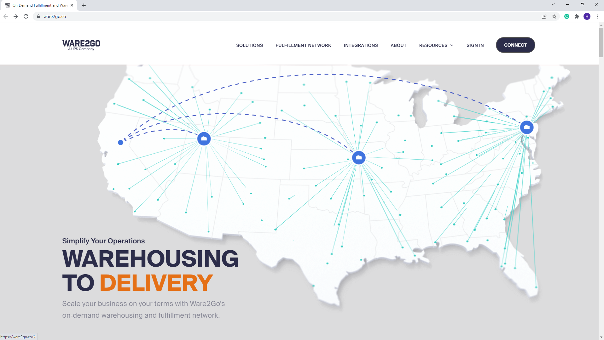
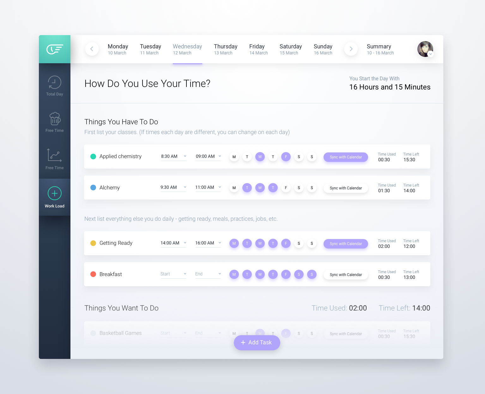

# Introduction UI/UX

## Resume Materi
Dalam materi ini, mempelajari:
- [Introduction UI/UX](#introduction-uiux)
  - [Resume Materi](#resume-materi)
    - [UX (User Experience)](#ux-user-experience)
      - [Tahapan UX Thinking](#tahapan-ux-thinking)
    - [2.	User Interface (UI)](#2user-interface-ui)
    - [3.	Protoype](#3protoype)
  - [Task](#task)
    - [Mencari dan menganalisa UI/UX](#mencari-dan-menganalisa-uiux)

### UX (User Experience)
Apapun yang pengguna rasakan ketika mereka menggunakan produk. UX terdiri dari bidang kelompok yang besar diantaranya ada: 
-	Business Logic
-	Technology
-	Interaction Logic
-	Design
-	Computer Communication
-	Business

#### Tahapan UX Thinking
1.	Empathize : berpura-pura / berimajinasi untuk melihat dunia dari sudut pandang user dan memahami perasaan para user sehingga komunikasi yang dibuat antara user dan pengelola software dapat terhubung / nyambung. Perlu membuat User Persona yang merupakan profile dari target user, prinsip mendasar dalam membuat suatu user persona adalah apasih desain yang kita buat dan untuk siapa desain / UX ini kita buat. 
Dari user persona ini akan terbuat sebuah karakteristik yang nantinya bisa dibuat menjadi user job stories yang meliput 3 hal yakni situasi (situation), motivasi (motivation), dan hasil yang diinginkan (outcome). Type of an actual user profile according to their expectations, needs, goals, and observed behaviour patterns -> User Persona
Usability Testing : salah satu cara untuk mengetahui apakah user dapat dengan mudah menggunakan software / program yang telah dibuat. Seberapa efisien dan efektif sebuah aplikasi dapat membantu user untuk mencapai tujuannya, serta bagaimana kepuasan user ketika menggunakan aplikasi tersebut. Usability testing dapat digunakan untuk produk / software yang baru dibuat dengan melakukan pengambilan data secara kualitatif melakukan interview kepada para user yang menggunakan produk kita. Pada produk / software yang sudah ada (existing product), kita dapat melakukan usability testing dengan pengambilan data secara kuantitatif dengan melakukan penyebaran angket kepada para user yang telah menggunakan produk tersebut.

2.	Define : pada tahap ini, kita menggunakan setiap informasi yang telah ciptakan atau kumpulkan pada tahap sebelumnya sehingga dapat memprioritaskan informasi yang ada. Harapan pada tahap ini kita dapat menentukan / mendefinisikan masalah inti dari user sehingga dapat memfokuskan apa yang perlu dikembangan dalam UX suatu produk.

3.	Ideate : User goal dapat berisikan dari user flow dari setiap langkah apa saja flow yang diperlukan bagi setiap user ketika menggunakan produk yang dibuat sehingga dapat terlihat hasil akhir atau goals yang bisa dicapai oleh user pada produk kita. Bisa dimulai dengan membuat task flow nya yang berisikan tahapan / langkah-langkah yang user lakukan sampai user menyelesaikan setiap langkahnya. Ketika task flow sudah selesai, maka kita bisa beralih untuk membuat wireflow yakni kombinasi antara wireframe dan flowchart. Wireframe merupakan sebuah kerangka untuk menata suatu item dalam produk, flowchart atau bagan alur adalah diagram yang menampilkan langkah-langkah dan keputusan untuk melakukan suatu proses dari suatu program. 

4. Prototype
5. Validate

### 2.	User Interface (UI)
Ketika sudah selesai tahapan wireflow maka kita bisa beralih ke user interface dari produk. User interface adalah visual yang user gunakan untuk berinteraksi pada aplikasi yang dibuat. UI memiliki 4 pilar didasari tentang bagaimana penampilan dan pemahaman dari desain agar bisa saling klop / bekerja sama (worked together).
-	Consistency : menggunakan desain yang memiliki pola yang sama untuk setiap halamannya serta alur penggunaan yang mirip untuk setiap halamannya. 
-	Keep the interface simple : perlu untuk menghilangkan elemen-elemen yang mungkin tidak diperlukan dalam sebuah halaman. Serta menggunakan bahasa yang jelas dalam setiap button / interaksi yang ada dapat membuat user lebih mudah dalam berinteraksi dalam aplikasi. 
-	Good Typography : penggunaan typeface yang tepat sesuai dengan kondisi halaman. Perlu diperhatikan juga seperti penggunaan ukuran, jenis font, dan tata letak pengaturan dalam menggunakan text sehingga dapat mudah untuk dibaca. 
-	Offer Informative Feedback : umpan balik dari suatu aksi yang diberikan kepada user haruslah berarti, relevan dan jelas. Bisa ditambahkan deskripsi sebagai penjelas bagi user.

### 3.	Protoype 
Merupakan sebuah simulasi atau contoh sampel yang menggambarkan final product. Tujuannya adalah digunakan untuk melakukan test product sebelum menghabiskan banyak waktu dan uang dalam projek yang dibuat. Selain itu tujuan dari prototype adalah mendapatkan feedback dari user, stakeholder, dan tim sehingga dapat memberikan masukan terkait produk yang akan dibuat. Kedua, juga bisa bertujuan untuk menunjukkan bentuk interaksi yang terjadi di projek nanti sehingga mempermudah developer untuk membuat program / aplikasi / software nantinya. Terdapat 3 pilar dalam prototype : 
-	Representation : Shows the platform used (mobile / desktop)
-	Precision : The fidelity of the prototype, ketepatan suatu prototype
-	Interactivity : Shows the functionality (interaction) to user
Tools prototyping : Axure RP, Adobe XD, invision, marvel, sketch, balsamiq, flinto, figma

## Task
### Mencari dan menganalisa UI/UX 
Pada task ini, saya ditantang untuk mencari beberapa web desain dan melakukan analisa terkait UI dan UX pada salah satu websitenya. 

Berikut merupakan link desain yang saya pilih untuk analisa:
- Ware2Go Website (Dribble : https://dribbble.com/shots/13812864-Ware2Go-Homepage)
- Furniture Landing Page (Dribble : https://dribbble.com/shots/15405230-Furniture-Landing-Page-Design)
- To Do App Task Screen Page (Uplabs : https://www.uplabs.com/posts/to-do-app-concept-add-task-screen)

Berikut merupakan google docs saya melakukan praktikum:
[UI UX Tugas Praktikum Deny](https://docs.google.com/document/d/1aLwpHvNi-0d5h0tjWLBKXbsV5YqaAD6H1RVweBa1nyE/edit?usp=sharing)

Berikut merupakan screenshot dari desain web yang saya pilih:

