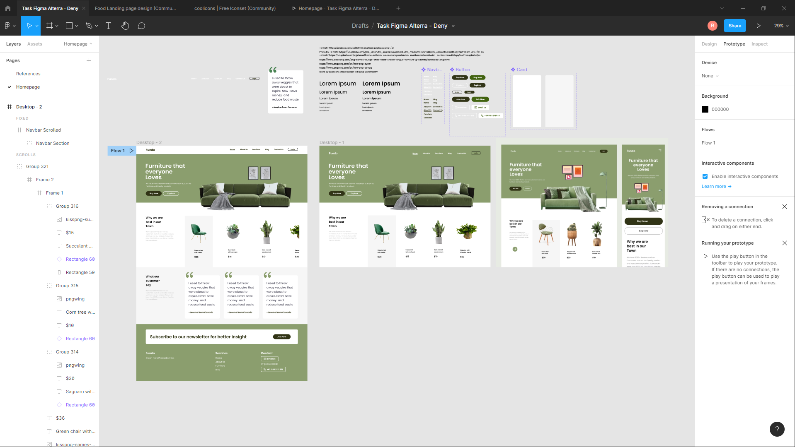

# Figma

## Resume Materi
Dalam materi ini, mempelajari:
- [Figma](#figma)
  - [Resume Materi](#resume-materi)
    - [1. Intro Figma](#1-intro-figma)
      - [Kelebihan Figma :](#kelebihan-figma-)
      - [Kekurangan Figma :](#kekurangan-figma-)
    - [2. Figma Utilities](#2-figma-utilities)
      - [IDE / Tools :](#ide--tools-)
      - [Melakukan import file sketch :](#melakukan-import-file-sketch-)
      - [Setting up frame baru / artboard :](#setting-up-frame-baru--artboard-)
      - [Setting grid dan layout kolom :](#setting-grid-dan-layout-kolom-)
      - [Layers dan groups :](#layers-dan-groups-)
    - [3. Prototyping](#3-prototyping)
  - [Task](#task)
    - [Mereplikasi desain yang telah ditemukan dan melakukan prototyping sederhana](#mereplikasi-desain-yang-telah-ditemukan-dan-melakukan-prototyping-sederhana)

### 1. Intro Figma
Figma merupakan editor graphic vector dan alat prototyping yang berbasis web dengan fitur offline yang digunakan untuk aplikasi desktop baik itu untuk macOS atau windows. 
#### Kelebihan Figma :
-	Aplikasi yang free 
-	Bisa digunakan Mac dan PC
-	Real-time team collaboration
-	Bisa import Sketch file tapi gabisa export Sketch file
-	Mengintegrasikan developer yang bekerja terpisah
-	Memiliki library yang bagus
-	Dapat melakukan integrasi prototyping
#### Kekurangan Figma :
-	Memerlukan jaringan internet untuk mengoperasikannya
-	Namun bisa digunakan secara offline, hanya saja filenya akan tersimpan secara local dan bisa ditambahkan nanti telah terhubung dengan internet

### 2. Figma Utilities

#### IDE / Tools :
-	Icon Figma : overview dari semua project dan files
-	Open file tab baru
-	Add / create single file
-	Tampilan awal berisikan draft dari project yang dimiliki / sedang dikerjakan
-	Pada sidebar menu terdapat draft yang bisa digunakan untuk mengakses recent file yang dikerjakan
-	Adapun beberapa section yang berkaitan saat bekerja kolaborasi dengan tim, yakni dari nama tim, project yang dimiliki / dikerjakan oleh tim, atau membuat tim baru

#### Melakukan import file sketch :
-	Drag and drop file sketch kedalam figma

#### Setting up frame baru / artboard :
-	Klik button frame atau tombol shortcut keyboard ‘F’
-	Kemudian klik pada kanvas dan pada bagian kanan lakukan pemilihan ukuran artboard yang akan dibuat

#### Setting grid dan layout kolom :
-	Pada sidebar di sebelah kanan, pada menu layout grid tambahkan sebuah pengaturan dan lakukan perincian grid properties kolom atau baris dengan memilih menu yang ada. Pengaturan yang bisa dilakukan lainnya adalah mengedit warna, jenis grid, lebar, jumlah, margin dan gutter dari grid kolom atau baris yang akan dibuat sesuai kebutuhan.

#### Layers dan groups :
-	Terletak pada sidebar bagian kiri, dibagi menjadi dua bagian yakni layers dan asset. Asset berisikan komponen-komponen yang dibuat pada project. Kemudian ada page untuk mempermudah pembagian / fokus desain pada kanvas. Lalu terdapat sebuah komponen, group item, text layer, shape, dan instance dalam bagian menu layers.
Images :
-	Bisa melakukan import untuk images atau gambar yang akan dimasukkan kedalam figma dengan cara drag and drop kemudian bisa dilakukan sebuah editing image properties seperti bagaimana ukuran, radius, bentuk pengeditan foto dan beberapa enhancement yang bisa diberikan pada image.
Typography :
-	Pertama buat text terlebih dulu melalui icon ‘T’ disamping icon frame pada menubar diatas, kemudian nanti akan muncul text properties yang bisa digunakan untuk melakukan edit ukuran, ketebalan, warna, alignment, dan spacing serta jenis dari font yang digunakan. 

### 3. Prototyping
Membuat sebuah simulasi dari desain yang telah dibuat dapat dengan melakukan:
- Mengeklik frame yang akan diberi aksi
- Pada sidebar kanan, klik menu prototype
- kemudian tambahkan interactions yang diinginkan, mulai dari ketika melakukan klik, hovering, atau saat mouse bergerak masuk ke frame dan lain-lain.
- tentukan perubahan yang diinginkan, arahkan ke frame baru hasil aksi
- tentukan juga animasi atau efek dalam proses prototyping seperti fade-in, fade-out, ease-in, ease-out, dan lain sebagainya 

## Task
### Mereplikasi desain yang telah ditemukan dan melakukan prototyping sederhana 
Pada task ini, saya ditantang untuk membuat atau melakukan rework desain yang telah saya temukan pada kegiatan sebelumnya dan mengaplikasikan prototyping sederhana pada desain. 

Berikut merupakan link desain yang saya pilih untuk digunakan sebagai dasar referensi:
- Furniture Landing Page (Dribble : https://dribbble.com/shots/15405230-Furniture-Landing-Page-Design)

Berikut merupakan google docs saya melakukan praktikum:
[Figma Tugas Praktikum Deny](https://www.figma.com/file/a2W6tzeA8Aiq3iANWkJpiH/Task-Figma-Alterra---Deny?node-id=7%3A7)

Berikut merupakan screenshot dari tampilan workspace figma desain web yang sudah saya buat:

