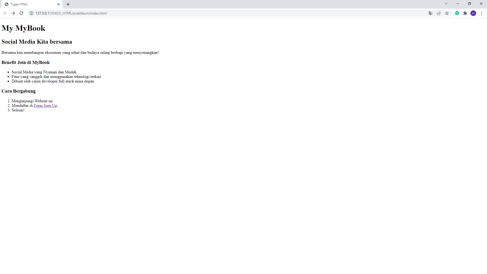
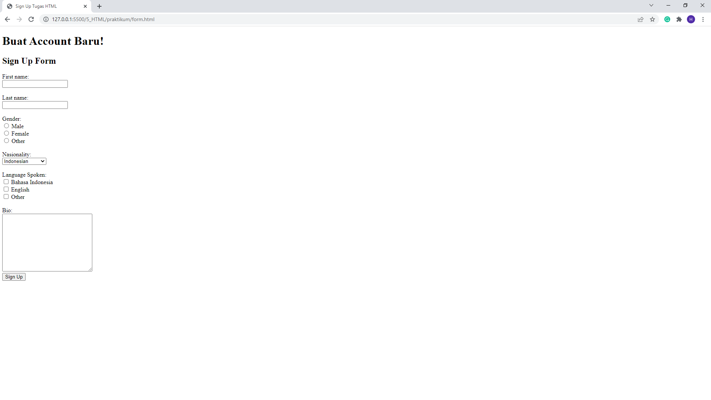
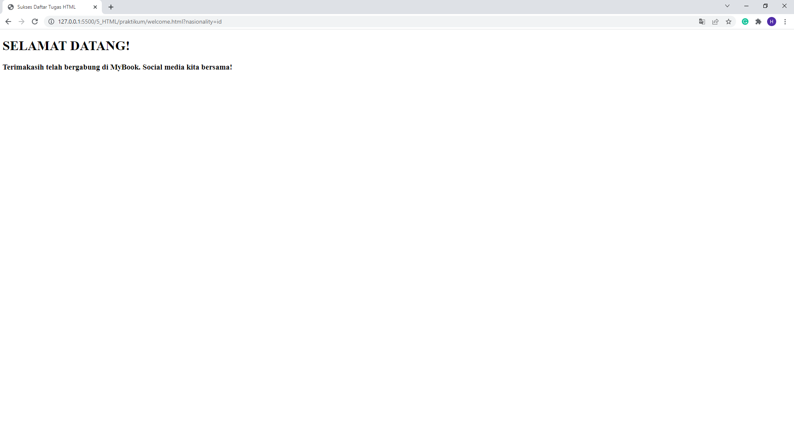

# HTML

## Resume Materi
Dalam materi ini, mempelajari:
- [HTML](#html)
  - [Resume Materi](#resume-materi)
    - [1. Intro Frontend Development](#1-intro-frontend-development)
    - [2. Intro HTML](#2-intro-html)
    - [3. More about HTML Tags](#3-more-about-html-tags)
  - [Task](#task)
    - [Membuat halaman web sederhana](#membuat-halaman-web-sederhana)

### 1. Intro Frontend Development

Pada proses web development dibagi menjadi dua yakni frontend dan backend. Backend merupakan bagian website yang tidak dapat berinteraksi langsung atau dilihat oleh user contohnya database. Sedangkan frontend merupakan bagian dari website yang bisa dilihat dan berinteraksi dengan user.
Secara istilah, frontend adalah sebuah bagian dari website yang membuat tampilan yang menarik kepada user yang dibangun dari 3 komponen utama yakni HTML, CSS, dan JS yang masing-masing memiliki fungsi dan perannya masing-masing
1.	HTML : berfungsi sebagai struktur yang akan membangun komponen website yang akan dibuat
2.	CSS : berfungsi untuk membuat tampilan website jadi lebih menarik
3.	JS : bertugas untuk memberikan fungsi fungsi sehingga website yang dibangun menjadi lebih hidup dan interaktif. 

### 2. Intro HTML

HTML merupakan singkatan dari Hypertext Markup Language atau yang bisa diartikan sebagai bahasa yang menggunakan marka atau tag untuk membuat sebuah website.
Kegunaan :
-	Membuat struktur konten dari halaman website
-	Mengatur tampilan dan isi dari halaman web
-	Membuat tabel dengan tag HTML table
-	Membuat form HTML
-	Membuat gambar dengan canvas
-	Mempublikasikan halaman website secara online
HTML Editors / Text editor berfungsi sebagai tempat untuk mengedit code html, diantaranya adalah notepad, vscode, sublime, notepad++, dan atom.

### 3. More about HTML Tags
Beberapa syntax HTML :
- < !DOCTYPE html>, < html>, < head>, < title>, < body> -> merupakan struktur tag utama yang diperlukan ketika membuat suatu website. 
- < h1> - < h6> & < p> -> merupakan tag untuk menghasilkan sebuah text dengan ukuran yang berbeda
- < strong>, < em>, < s>, < u>, < br /> -> merupakan tag untuk melakukan styling text
- < a href=”” target=”_blank”> -> merupakan tag link yang ketika berinteraksi dengan user bisa mengarahkan user ke halaman lain. 
- < img src=”” alt=””> -> tag yang berfungsi untuk menampilkan sebuah gambar
- < ol>, < ul>, < li> merupakan tag untuk membuat list dengan penanda angka atau bullet icon. < ol> bisa dikustomisasi tipe urutannya dengan < ol type=”a/A/i/I”>, < ul> juga bisa dikustomisasi simbolnya dengan < ul type=”square/disc/circle”>
- < table>, < tr>, < td>, < th> -> merupakan tag yang digunakan untuk membuat table lengkap dengan baris, header, dan konten table
- < input type=””> merupakan tag yang digunakan untuk membuat form. Tag input mempunyai banyak tipe yakni text, number, radio, password, dll
- < fieldset>, < legend>, < label> merupakan tag yang digunakan untuk membuat form menjadi lebih informatif bagi pengguna. 

## Task
### Membuat halaman web sederhana
Pada task ini, saya ditantang untuk membuat 3 halaman web sederhana sesuai dengan contoh referensi yang diberikan. 

Berikut merupakan link repo 3 halaman file tersebut:
[Repo Tugas Praktikum HTML Deny](https://github.com/denyFh/tugas-react/tree/master/Section%205%20HTML)

Berikut merupakan screenshot dari tampilan workspace figma desain web yang sudah saya buat:

