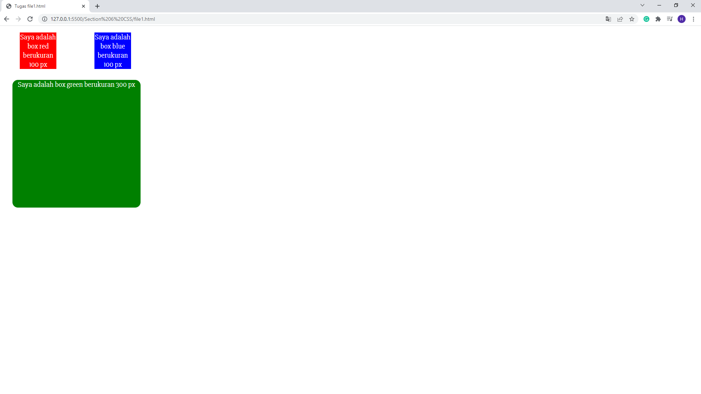
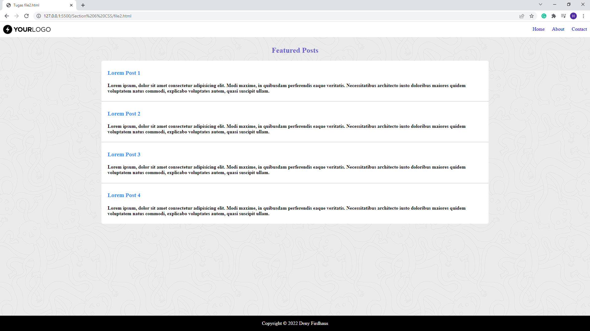

# CSS

## Resume Materi
Dalam materi ini, mempelajari:
- [CSS](#css)
  - [Resume Materi](#resume-materi)
    - [1. Intro CSS](#1-intro-css)
    - [2. CSS Usage](#2-css-usage)
    - [3. More about CSS Styling](#3-more-about-css-styling)
  - [Task](#task)
    - [Membuat styling halaman web sederhana](#membuat-styling-halaman-web-sederhana)

### 1. Intro CSS

CSS merupakan singkatan dari Cascading Style Sheets yang berfungsi untuk menghias halaman dan mengatur peletakan posisi pada suatu halaman website. Terdapat tiga cara untuk menambahkan CSS kedalam suatu HTML / website yakni:
1. External CSS: ditambahkan melalui file ekstensi .css yang kemudian digabungkan ditambahkan menyisipkan tag < link> pada tag < head> sebuah HTML
2. Internal CSS: ditambahkan pada dalam file HTML pada tag < style> pada bagian < head> atau < body>.
3. Inline CSS: ditambahkan langsung kedalam elemen tunggal atau tag yang ingin dihias dengan menggunakan atribut style 

### 2. CSS Usage

Syntax CSS terdiri dari:
1. Selector dan minimal 1 declaration
2. Dalam sebuah declaration terdapat sebuah property dan value

CSS Selector: Penanda digunakan untuk mempermudah target hias dalam CSS, terdapat dua penanda yang digunakan yakni untuk ID menggunakan (# atau tanda pagar) dan untuk class menggunakan (. atau tanda titik).

CSS Grouping: Beberapa selector dapat dikelompokkan dalam satu deklarasi style, sehingga tidak perlu menulis style yang sama berulang kali. Caranya adalah dengan menggunakan tanda koma (,). Contoh h1,h2 { style}.

### 3. More about CSS Styling
Beberapa styling pada CSS:
- CSS Font Properties: font, font-family, font-size, font-weight, font-style, dan @import font.
- CSS Margin & Padding properties: margin, padding dan bagian arah yang ingin berikan semisal ingin lebih rinci semisal margin-top atau padding-right.
- CSS Background Properties: background-color, background-image, background-repeat, background-size, background-position. 
- CSS Link: merupakan link event yang dituliskan setelah selector dengan awalan (:) diantaranya, :hover, :active, :visited. Adapun memberikan efek transisi dengan property 'transition'.
- CSS Table Properties: merupakan style yang digunakan untuk menghias elemen table pada html diantaranya, border, border-collapse, dan :nth-child(even).
- Extra style clearfix yang bisa diberikan untuk merapikan konten dengan properties 'float'.

## Task
### Membuat styling halaman web sederhana
Pada task ini, saya ditantang untuk membuat 2 halaman web sederhana yang distyling sesuai dengan contoh referensi yang diberikan.

Berikut merupakan link repo 2 halaman dengan styling tersebut:
[Repo Tugas Praktikum CSS Deny](https://github.com/denyFh/tugas-react/tree/master/Section%206%20CSS)

Berikut merupakan screenshot dari tampilan web yang sudah saya buat:

