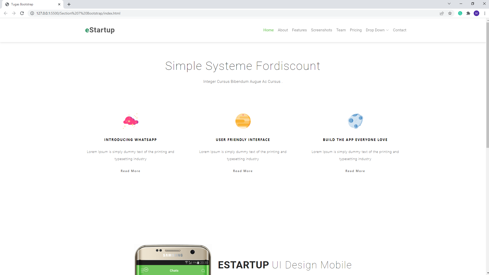
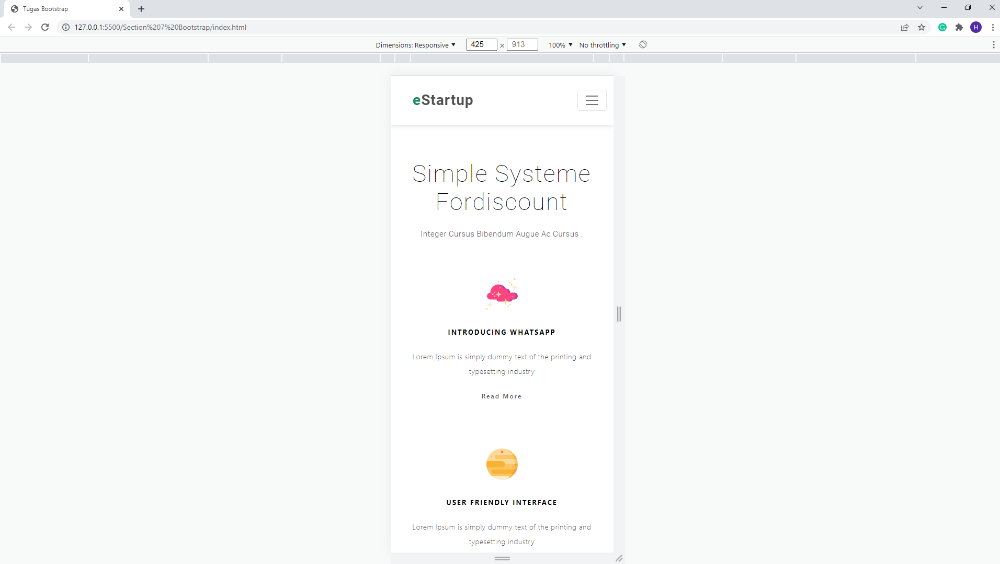

# Bootstrap

## Resume Materi
Dalam materi ini, mempelajari:
- [Bootstrap](#bootstrap)
  - [Resume Materi](#resume-materi)
    - [1. Intro Boostrap](#1-intro-boostrap)
    - [2. Bootstrap Usage](#2-bootstrap-usage)
    - [3. More about Bootstrap](#3-more-about-bootstrap)
  - [Task](#task)
    - [Membuat halaman web sederhana dengan menggunakan bootstrap](#membuat-halaman-web-sederhana-dengan-menggunakan-bootstrap)

### 1. Intro Boostrap

Bootstrap merupkaan sebuah framework untuk membuat website yang responsive dan mudah digunakan dalam sebuah pengembangan sistem terutama sebagai sebuah front-end engineer. Cara untuk menambahkan bootstrap kedalam suatu HTML / website yakni:
1. Menambahkan < link> dengan target CDN bootstrap sesuai dengan versi terbaru yang bisa di copy paste melalui website resminya
2. Menambahkan < script> dengan opsi source bundle bootstrap atau separate bootstrap dan popperJs.
3. Cara terakhir dapat digunakan dengan mengcopy starter template yang sudah disediakan pada website bootstrap.

### 2. Bootstrap Usage

Penggunaan bootstrap banyak digunakan untuk mendapatkan shortcut sebuah style dengan class sederhana yang bisa disesuaikan oleh developer nantinya. Beberapa hal yang termasuk dalam coverage penggunaan bootstrap diantaranya:
1. Layouting : merupakan hal yang digunakan untuk mengontrol responsivitas tampilan dengan suatu breakpoint seperti xs,sm,md,lg,xl, dan xxl.
2. Content : merupakan hal yang digunakan untuk mengontrol bentuk dan hiasan yang digunakan pada suatu elemen seperti typography, images, tables, dan figures serta colors palette bawaan dari bootstrap.
3. Forms : merupakan hal yang berfokus untuk mempermudah control suatu forms pada website mulai dari untuk hiasan, grouping, dan interaksinya nanti pada backend.

### 3. More about Bootstrap
Selain hal yang sudah disebutkan tadi bootstrap juga menydiakan beberapa komponen basic yang bisa digunakan oleh developer secara langsung. komponen yang dimaksud disini adalah suatu bagian yang mungkin dipakai dalam website seperti komponen navbar, card, modal, dropdowns, carousel images, dan lain sebagainya. Hal ini bisa developer gunakan sebagai shortcut sehingga proses pengerjaan menjadi lebih mudah serta komponen tersebut masih bisa di custom sesuai dengan kebutuhan.

## Task
### Membuat halaman web sederhana dengan menggunakan bootstrap
Pada task ini, saya ditantang untuk membuat sebuah halaman web sederhana yang distyling sesuai dengan contoh referensi dengan menggunakan boostrap.

Berikut merupakan link repo halaman dengan styling bootstrap tersebut:
[Repo Tugas Praktikum Bootstrap Deny](https://github.com/denyFh/tugas-react/tree/master/Section%207%20Bootstrap)

Berikut merupakan screenshot dari tampilan web yang sudah saya buat:

