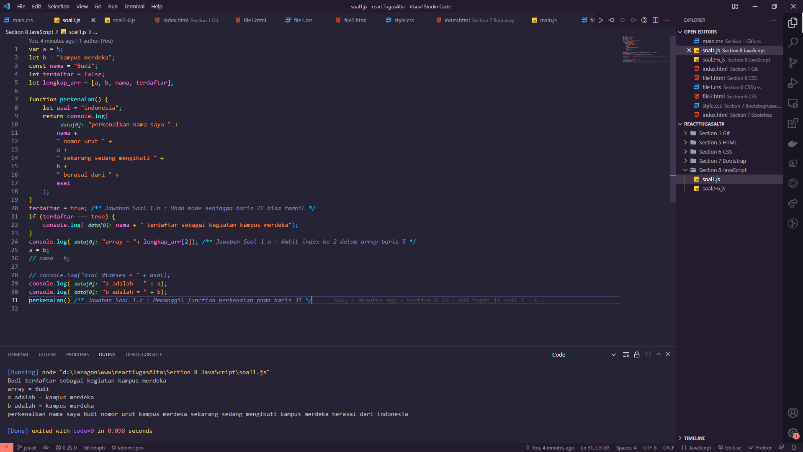
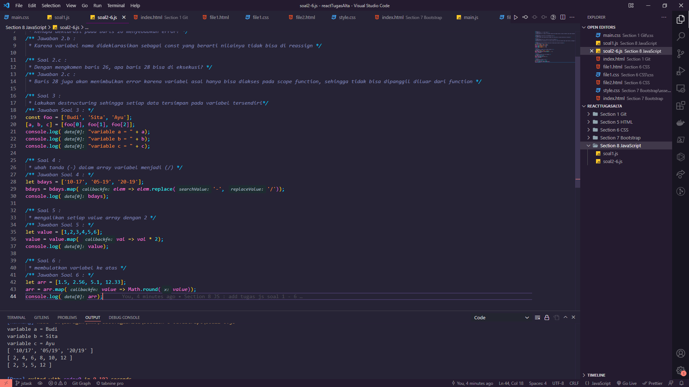

# JavaScript Refreshment

## Resume Materi
Dalam materi ini, mempelajari:
- [JavaScript Refreshment](#javascript-refreshment)
  - [Resume Materi](#resume-materi)
    - [1. Intro JS and Basic Understanding of JS](#1-intro-js-and-basic-understanding-of-js)
      - [1.a Declaration](#1a-declaration)
      - [1.b Interacting with Declaration](#1b-interacting-with-declaration)
      - [1.c Scoping](#1c-scoping)
      - [1.d More Basic Knowledge](#1d-more-basic-knowledge)
    - [2. Values, Method and Flow](#2-values-method-and-flow)
      - [2.a Values, Destructuring, and Spread](#2a-values-destructuring-and-spread)
      - [2.b Method](#2b-method)
      - [2.c Flow](#2c-flow)
    - [3. Function, Class, Async - Await](#3-function-class-async---await)
      - [3.a Function and its kind](#3a-function-and-its-kind)
      - [3.b Classes](#3b-classes)
      - [3.c Async - Await and DOM](#3c-async---await-and-dom)
  - [Task](#task)
    - [Menjawab pertanyaan seputar javascript](#menjawab-pertanyaan-seputar-javascript)

### 1. Intro JS and Basic Understanding of JS

JavaScript merupakan bahasa pemrograman high-level, scripting, untyped, dan interpreted. High-level berarti bahasa pemrograman ini merupakan bahasa yang mudah dimengerti oleh manusia. JavaScript atau JS dibuat untuk berinteraksi dengan sebuah halaman website apapun web browsernya.

#### 1.a Declaration
Jenis declaration merupakan proses pembuatan variabel untuk menyimpan data.
- Var : deklarasi yang jarang digunakan namun mirip dengan deklarasi let.
- Let : deklarasi yang digunakan ketika kita membutuhkan nilai variable yang bisa diubah.
- Const : deklarasi yang digunakan ketika kita membutuhkan nilai yang tidak bisa di berikan nilai baru ketika deklarasi tersebut sudah diberikan suatu nilai.

#### 1.b Interacting with Declaration
- Deklarasi var dan let bisa di gunakan tanpa memberikan nilai, akan memberikan hasil undefined, sedangkan pada deklarasi const perlu diberikan suatu nilai karena ketika kosong maka akan memberikan sebuah error.
- Redeclaration merupakan deklarasi ulang baik itu var, let atau const dengan nama yang sama. Var tidak memunculkan error ketika dilakukan redeclaration, namun untuk let dan const akan muncul error ketika dilakukan redeclaration sehingga let dan const tidak dapat melakukan deklarasi ulang.
- Reassignment merupakan pemberian nilai baru kepada suatu variabel yang sudah bernilai sebelumnya. Var dan let bisa untuk dilakukan suatu reassignment namun untuk const tidak dapat dilakukan sebuah reassignment.

#### 1.c Scoping 
Scoping merupakan penentuan dimana variabel fungsi dan objek diatur dan dapat diakses dalam kode atau bisa berarti sebuah ruang lingup variabel dikendalikan oleh lokasi deklarasi. Terdapat tiga jenis scoping yakni:
- Global : saat variabel di deklarasikan, variabel tersebut bisa diakses dalam setiap kondisi
- Function : mendeklarasikan sebuah variabel dalam suatu function, sehingga scope hanya berfungsi didalam function tersebut tidak diluar function.
- Block : mendeklarasikan suatu variabel didalam sebuah block scope dan dalam scope tersebut hanya deklarasi var yang bisa diambil nilainya. 

#### 1.d More Basic Knowledge
Hoisting merupakan pembuatan beberapa jenis variabel atau fungsi dapat diakses / digunakan dalam kode sebelum di deklarasikan. Deklarasi var dan function termasuk hoisted sehingga mereka bisa digunakan sebelum deklarasi itu sendiri terjadi.  Sedangkan deklarasi let dan const tidak termasuk hoisted karena perlu untuk di inisiasi terlebih dahulu

### 2. Values, Method and Flow

#### 2.a Values, Destructuring, and Spread
- Primitive merupakan unit pemprosesan terkecil dan elemen paling sederhana yang tersedia dalam bahasa pemrograman. Contohnya string, bool, number, bigint, undefined, null, dan symbol.
- Objects merupakan unit yang menyimpan properti dan fungsi atau method. Contohnya objects, array, function, date, set, map, weak 
- Destructuring merupakan ekspresi dari JS yang memungkinkan untuk menyalin nilai dari array, atau properti dari objek, ke dalam variabel yang berbeda. Destructuring dapat dilakukan pada array dan object, yang membedakan variabel tersebut merupakan array dan object adalah tanda kurung yang digunakan, array menggunakan kurung siku, sedangkan object menggunakan kurung kurawal.
- Spread syntax dapat digunakan ketika semua elemen dari object atau array perlu dimasukkan ke dalam semacam daftar. Spread syntax digambarkan dengan titik tiga (…) diikuti dengan variabel yang akan disalin. 
- Perbedaan dari destructuring dengan saat menggunakan spread syntax terletak ketika kita mengubah variabel yang disalin, dimana variabel yang diubah ketika melakukan penyalinan biasa maka kedua variabel akan berubah, sedangkan ketika menggunakan spread syntax maka hanya variabel yang diubah saja yang berubah nilainya. 

#### 2.b Method
Method merupakan sebuah fungsin yang terkait dengan objek, membuat programnya se-sederhana mungkin sesuai dengan kegunaan masing-masing atau bisa dibilang suatu shortcut ketika melakukan programming pada JS. Beberapa method yang akan dibahas diantaranya yakni:
- Concat: menggabungkan dua atau lebih array dan mengembalikan Salinan array yang digabungkan mirip dengan spread syntax namun terdapat perbedaan kapan untuk menggunakannya, jika untuk menyalin menggunakan spread syntax namun jika untuk menggabungkan dua array lebih baik menggunakan method concat. 
- Map: Membuat array baru dengan hasil memanggil fungsi untuk setiap elemen array. Hasil dari method function adalah sebuah array.
- Foreach: Memanggil fungsi untuk setiap elemen array, perbedaan dengan map adalah jika map digunakan untuk looping dan menghasilkan array namun foreach itu melakukan looping dan operasi terjadi di dalam array tersebut.
- Slice: Memilih bagian dari array dan mengembalikan array baru. 
- Filter: Membuat array baru dengan setiap elemen dalam array yang lulus seleksi / kondisi. 
- Reduce: Melakukan operasi pada setiap elemen array menjadi nilai tunggal (dilakukan dari kiri ke kanan)

#### 2.c Flow
Terdapat 2 jenis dari alur sebuah program berjalan yakni
- Normal Flow : pengeksekusian statement dari atas ke bawah atau kiri ke kanan yang dilakukan secara berurutan
- Control Flow : mengatur alur eksekusi pada statement atau jalannya program sesuai keinginan kita. Untuk membuat suatu control flow kita membutuhkan looping dan percabangan / pengkondisian untuk mengatur alur dari kode yang dibuat. -
- Pengulangan bisa menggunakan for, while dan do while untuk mengatur jumlah eksekusi statement yang diberikan
- Pengkondisian bisa menggunakan if – else, switch, block, try – catch, break, continue, throw untuk menyediakan beberapa pilihan alur statement yang dikerjakan dalam suatu kondisi. Beberapa pengertian pengkondisian:
- Try – catch: try bertugas mengeksekusi statement di dalamnya, sedangkan catch bertugas menangkap error yang terjadi pada statement di dalam try.
- Throw : throw terjadi di dalam block try, bertugas melemparkan error sesuai kondisi yang diinginkan, error itu akan ditangkap oleh catch

### 3. Function, Class, Async - Await
#### 3.a Function and its kind
Function pada JS adalah sebuah objek, karena memiliki properti dan juga method. Function digunakan untuk melakukan serangkaian komputasi / prosedur yang dapat digunakan berulang kali. 
- Deklarasi fungsi :
Function {nama fungsi}(param1, param2) { 
	Console.log(param1 + “ ” + param2); -> area / scope fungsi  
} 
{nama fungsi}(param1, param2) -> pemanggilan fungsi
- Function expression -> membuat function menjadi sebuah variabel, caranya tambahkan deklarasi variabel pada nama fungsi diikuti = suatu function. Contoh:  
Let namaLengkap = function (param1, param2) {…}
- Arrow Function -> hampir sama dengan function expression namun penulisan function ditiadakan diganti dengan tanda panah (kombinasi tanda sama dengan dan tanda lebih dari {=>}) contoh:  
Let namaLengkap = (param1, param2) => {…}

#### 3.b Classes
Secara definisi, class adalah prototype dari suatu object yang akan kita buat. Constructor adalah method di dalam class yang akan selalu terpanggil pertama kali ketika membuat object. Method adalah sebuah fungsi yang berada di dalam class yang terpanggil jika dipanggil oleh kita. Attributes merupakan kumpulan variabel yang membentuk object yang dimiki oleh suatu class. Extend digunakan untuk membuat kelas anak dari kelas induk, kelas anak mewarisi semua atribut dan metode dari kelas induk. 

#### 3.c Async - Await and DOM
- Synchronous: mengekseskusi setiap perintah satu persatu sesuai urutan kode yang dituliskan. Output dari code sesuai dengan urutan karena setiap perintah harus menunggu perintah sebelumnya selesai.
- Asynchronous: hasil eksekusi atau output yang tidak selalu berdasarkan urutan kode tetapi berdasarkan waktu proses kode. Contohnya setTimeout digunakan untuk menunda eksekusi sehingga sambil menunggu maka js akan mengeksekusi perintah selanjutnya.
- Callback: fungsi yang dikirimkan sebagai parameter pada fungsi lain atau fungsi yang dieksekusi setelah fungsi lain selesai dijalankan. 
- Promise: objek yang merepresentasikan keberhasil atau kegagalan pada sebuah event yang asynchronous dimasa mendatang terdapat 3 yakni resolve – then(), reject – catch(), finally. 
- Asynchronous function: sebuah function yang bekerja secara asynchronous yang menghasilkan promise sebagai return value-nya, tetapi cara penulisan code-nya menggunakan penulisan yang synchronous (standar). 
- Await: sebuah keyword yang terdapat pada async function yang tujuannya menghentikan eksekusi sambil menunggu promise-nya selesai.
- DOM : Document Object Model (DOM) adalah suatu API untuk HTML yang merepresentasikan halaman web pada suatu dokumen menjadi sebuah object. 

## Task
### Menjawab pertanyaan seputar javascript
Pada task ini, saya ditantang untuk menjawab 6 buah pertanyaan mengenai javascript yang telah disediakan sebuah kode kemudian menjawabnya ataupun membuat sendiri kode javascript sesuai case pertanyaan.

Berikut merupakan link repo 2 halaman dengan styling tersebut:
[Repo Tugas Praktikum JS Deny](https://github.com/denyFh/tugas-react/tree/master/Section%208%20JavaScript)

Berikut merupakan screenshot dari tampilan web yang sudah saya buat:

