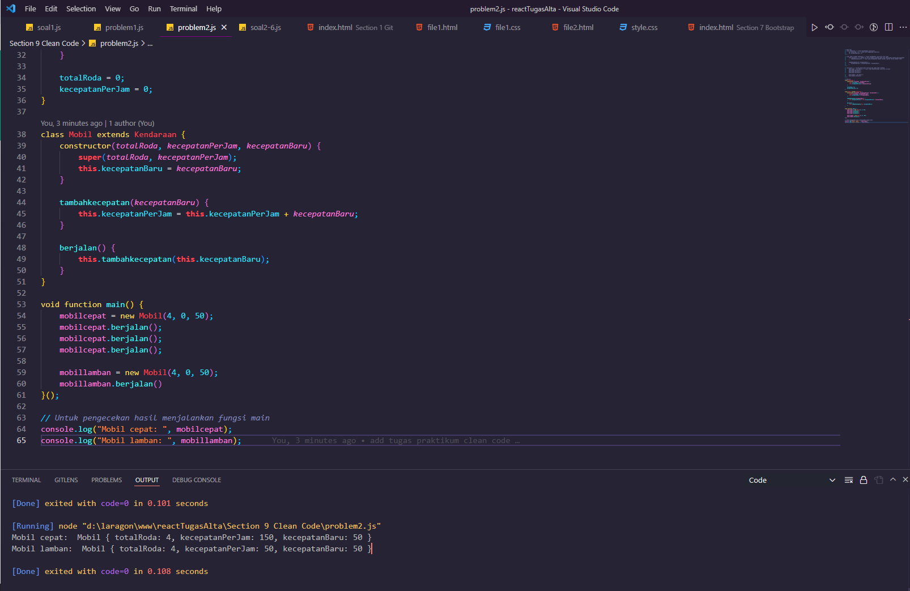

# Clean Code

## Resume Materi
Dalam materi ini, mempelajari:
- [Clean Code](#clean-code)
  - [Resume Materi](#resume-materi)
    - [1. What is Clean Code? Why Clean Code?](#1-what-is-clean-code-why-clean-code)
    - [2. Clean Code Characteristics](#2-clean-code-characteristics)
    - [3. Clean Code Principle](#3-clean-code-principle)
  - [Task](#task)
    - [Melakukan analisa dan rewriting javascript](#melakukan-analisa-dan-rewriting-javascript)

### 1. What is Clean Code? Why Clean Code?

Clean code merupakan istilah untuk kode yang mudah dibaca, difahami dan diubah oleh developer. Beberapa alasan kenapa kita harus mengimplementasikan clean code diantaranya:
1. Work Collaboration: semua orang dalam tim harus bisa mengerti maksud dari code yang ditulis.
2. Feature Development: mengetahui fungsi dari fitur agar lebih jelas dan mudah dipahami.
3. Faster Development: jika kedua hal sebelumnya terpenuhi maka secara tidak langsung akan mempercepat proses development suatu aplikasi atau sistem.

### 2. Clean Code Characteristics

Beberapa karakteristik penggunaan clean code yang benar diantaranya:
1. Mudah difahami: menggunakan penamaan yang mudah difahami
2. Mudah dieja dan dicari
3. Singkat namun mendeskripsikan konteks
4. Konsisten: jika penulisan besar maka besar terus, mengunakan camelcase maka menggunakan camelcase untuk semua penulisannya
5. Hindari penambahan konteks yang tidak perlu misalnya repetisi penggunaan nama 
6. Komentar: cukup menggunakan komentar pada hal yang penting namun mendeskripsikan keseluruhan bagian yang terkait
7. Good function: membuat function dengan urutan yang benar dan relevan dalam penamaannya
8. Gunakan konvensi: menggunakan referensi atau style guide dalam menuliskan kode
9. Formatting: indentasi dan penempatan variabel atau fungsi yang konsisten antar satu sama lain.

### 3. Clean Code Principle
- KISS : Keep It So Simple
Fungsi atau class harus kecil, fungsi untuk satu tugas, argumen yang core saja, sehingga mencapai kondisi seimbang, kecil, dan jumlahnya minimal.
- DRY : Don't Repeat Yourself
Menghindari duplikasi kode dilakukan dengan membuat fungsi yang bisa digunakan secara repetitif atau umum.
- Refactoring : restrukturisasi kode yang mengubah struktur internal tanpa mengubah output untuk mencapai kedua prinsip sebelumnya.

## Task
### Melakukan analisa dan rewriting javascript 
Pada task ini, saya ditantang untuk menganalisa sebuah kode javascript kemudian mencari beberapa hal yang salah dalam kode tersebut dan tugas kedua adalah melakukan rewriting kode javascript sehingga menjadi lebih terbaca dan rapi.

Berikut merupakan link repo halaman dengan styling bootstrap tersebut:
[Repo Tugas Praktikum Clean Code Deny](https://github.com/denyFh/tugas-react/tree/master/Section%209%20Clean%20Code)

Berikut merupakan screenshot dari hasil run kode js problem2:

